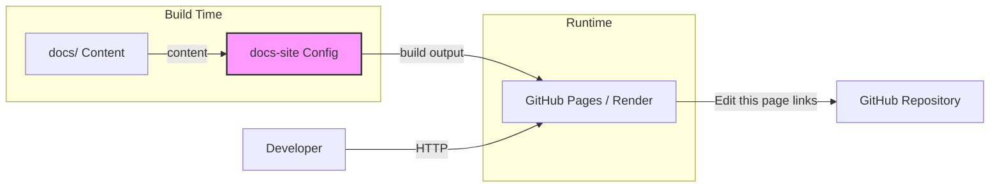

# docs-site — Integration Points Diagram

> Auto-generated: 2026-05-12

## Service Connectivity

```mermaid
graph LR
    subgraph "Build Time"
        DocsSite[docs-site Config]
        DocsDir["docs/ Content"]
    end

    subgraph "Runtime"
        Host[GitHub Pages / Render]
    end

    GitHub[GitHub Repository]

    DocsDir -->|"content"| DocsSite
    DocsSite -->|"build output"| Host
    Host -->|"Edit this page links"| GitHub
    User[Developer] -->|"HTTP"| Host

    style DocsSite fill:#f9f,stroke:#333,stroke-width:2px
```

No runtime integrations — static site only.
