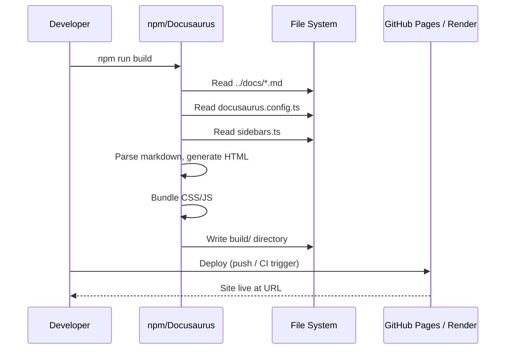
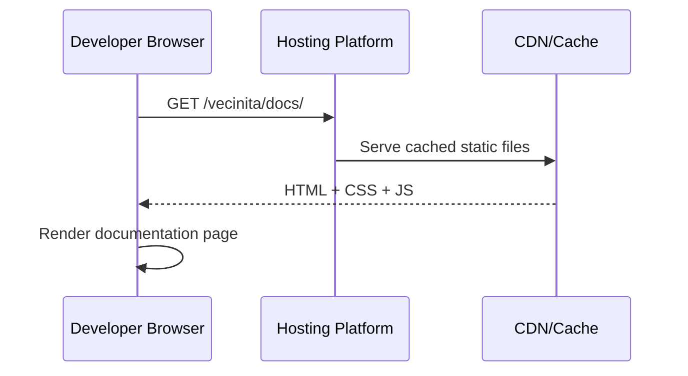
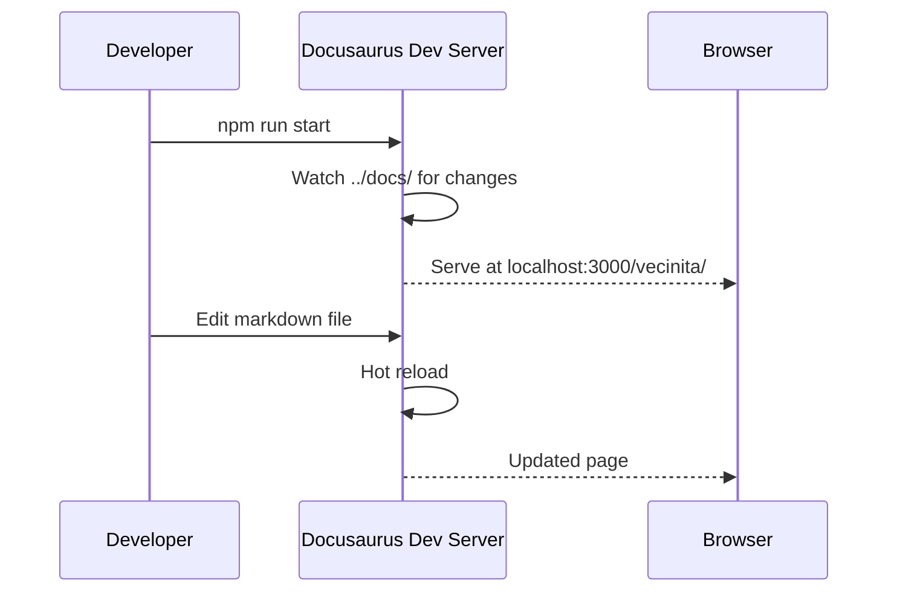

# docs-site — Sequence Flow Diagrams

> Auto-generated: 2026-05-12

## Build and Deploy Flow

```mermaid
sequenceDiagram
    participant Dev as Developer
    participant CLI as npm/Docusaurus
    participant FS as File System
    participant Host as GitHub Pages / Render

    Dev->>CLI: npm run build
    CLI->>FS: Read ../docs/*.md
    CLI->>FS: Read docusaurus.config.ts
    CLI->>FS: Read sidebars.ts
    CLI->>CLI: Parse markdown, generate HTML
    CLI->>CLI: Bundle CSS/JS
    CLI->>FS: Write build/ directory
    Dev->>Host: Deploy (push / CI trigger)
    Host-->>Dev: Site live at URL
```

## Page Request Flow

```mermaid
sequenceDiagram
    participant User as Developer Browser
    participant Host as Hosting Platform
    participant CDN as CDN/Cache

    User->>Host: GET /vecinita/docs/
    Host->>CDN: Serve cached static files
    CDN-->>User: HTML + CSS + JS
    User->>User: Render documentation page
```

## Local Development Flow

```mermaid
sequenceDiagram
    participant Dev as Developer
    participant DS as Docusaurus Dev Server
    participant Browser

    Dev->>DS: npm run start
    DS->>DS: Watch ../docs/ for changes
    DS-->>Browser: Serve at localhost:3000/vecinita/
    Dev->>DS: Edit markdown file
    DS->>DS: Hot reload
    DS-->>Browser: Updated page
```
