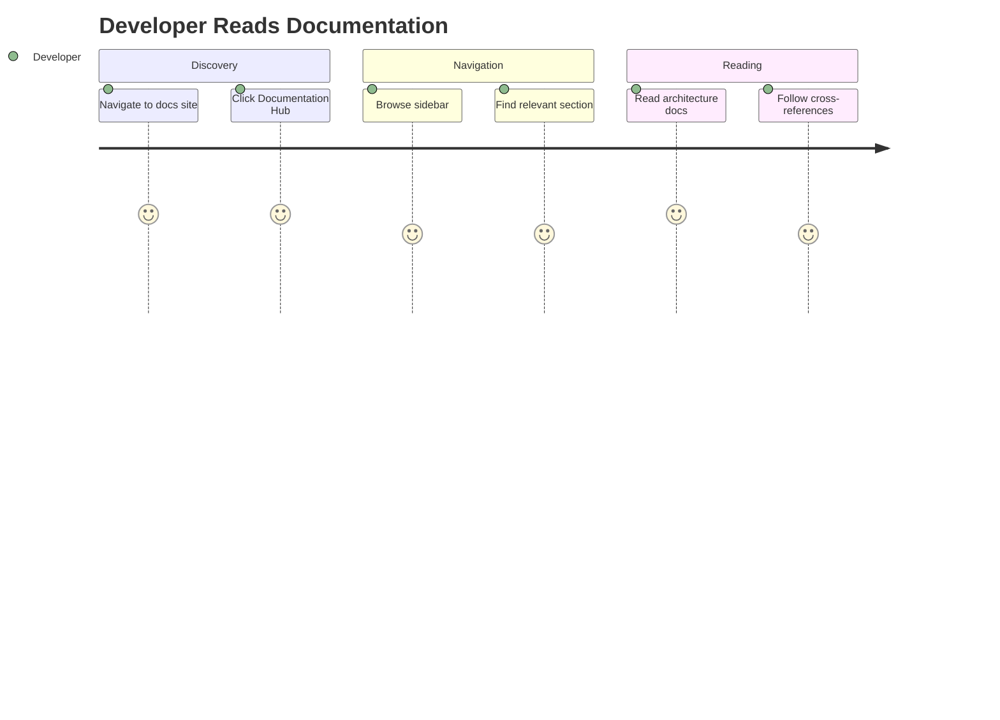
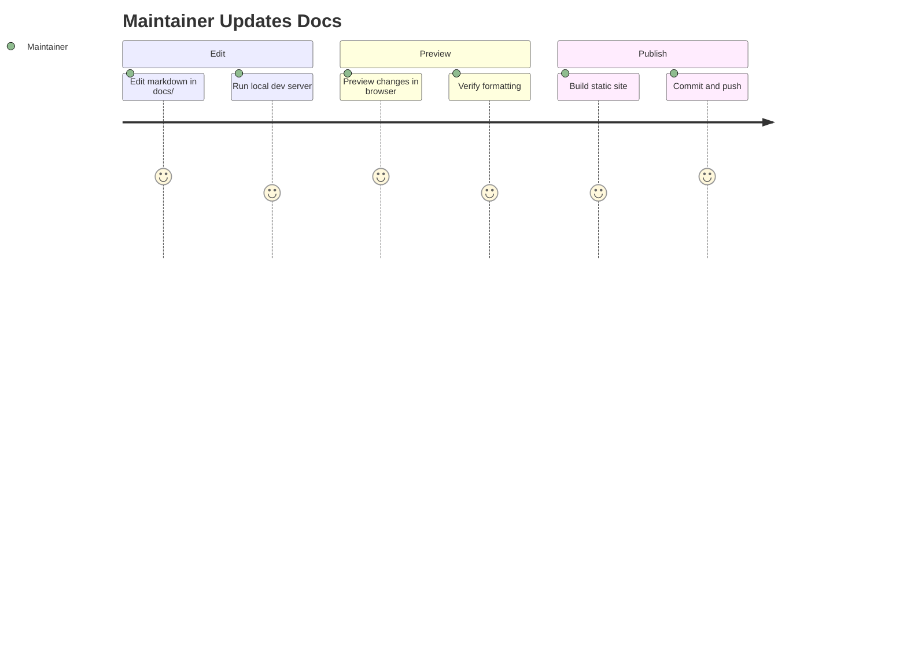

# docs-site — User Journey Diagrams

> Auto-generated: 2026-05-12

## Browse Architecture Documentation

```mermaid
journey
    title Developer Reads Documentation
    section Discovery
        Navigate to docs site: 5: Developer
        Click Documentation Hub: 5: Developer
    section Navigation
        Browse sidebar: 4: Developer
        Find relevant section: 4: Developer
    section Reading
        Read architecture docs: 5: Developer
        Follow cross-references: 4: Developer
```

## Edit Documentation

```mermaid
journey
    title Maintainer Updates Docs
    section Edit
        Edit markdown in docs/: 5: Maintainer
        Run local dev server: 4: Maintainer
    section Preview
        Preview changes in browser: 5: Maintainer
        Verify formatting: 4: Maintainer
    section Publish
        Build static site: 4: Maintainer
        Commit and push: 5: Maintainer
```
