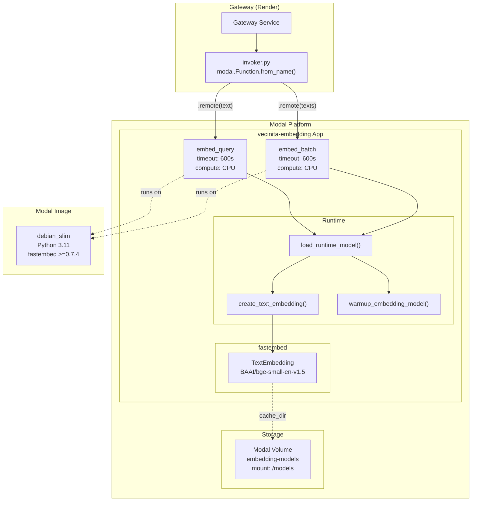
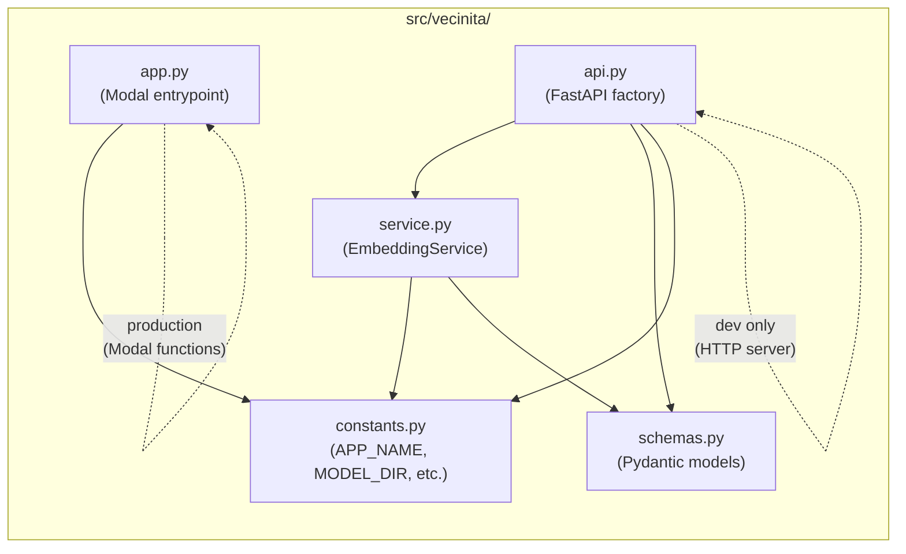

# Architecture Diagram: Embedding Worker
> Auto-generated: 2026-05-12

## Component and Deployment Diagram

```mermaid
graph TB
    subgraph "Gateway (Render)"
        GW[Gateway Service]
        INV["invoker.py<br/>modal.Function.from_name()"]
        GW --> INV
    end

    subgraph "Modal Platform"
        subgraph "vecinita-embedding App"
            EQ["embed_query<br/>timeout: 600s<br/>compute: CPU"]
            EB["embed_batch<br/>timeout: 600s<br/>compute: CPU"]

            subgraph "Runtime"
                LRM["load_runtime_model()"]
                CTE["create_text_embedding()"]
                WEM["warmup_embedding_model()"]
                LRM --> CTE
                LRM --> WEM
            end

            subgraph "fastembed"
                TE["TextEmbedding<br/>BAAI/bge-small-en-v1.5"]
            end

            EQ --> LRM
            EB --> LRM
            CTE --> TE
        end

        subgraph "Storage"
            VOL["Modal Volume<br/>embedding-models<br/>mount: /models"]
        end

        TE -.->|cache_dir| VOL
    end

    INV -->|".remote(text)"| EQ
    INV -->|".remote(texts)"| EB

    subgraph "Modal Image"
        IMG["debian_slim<br/>Python 3.11<br/>fastembed >=0.7.4"]
    end

    EQ -.->|runs on| IMG
    EB -.->|runs on| IMG
```

## Internal Module Diagram

```mermaid
graph LR
    subgraph "src/vecinita/"
        APP["app.py<br/>(Modal entrypoint)"]
        SVC["service.py<br/>(EmbeddingService)"]
        SCH["schemas.py<br/>(Pydantic models)"]
        API["api.py<br/>(FastAPI factory)"]
        CON["constants.py<br/>(APP_NAME, MODEL_DIR, etc.)"]
    end

    APP --> CON
    SVC --> CON
    SVC --> SCH
    API --> SVC
    API --> SCH
    API --> CON

    APP -.->|"production<br/>(Modal functions)"| APP
    API -.->|"dev only<br/>(HTTP server)"| API
```

See: [Architecture](../07-architecture.md)
