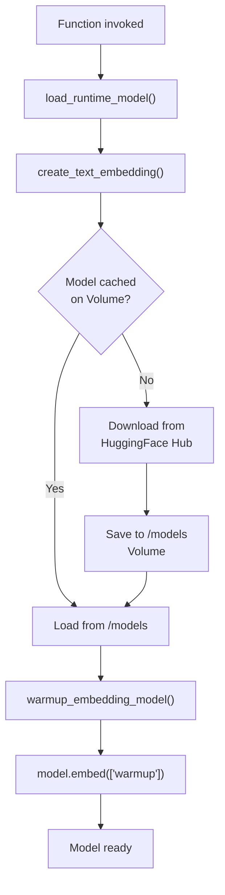
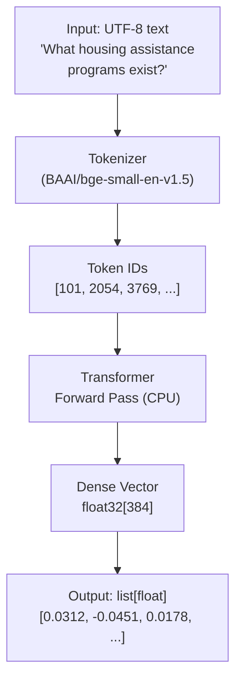

# Data Flow Diagram: Embedding Worker
> Auto-generated: 2026-05-12

## Single Embedding Flow

```mermaid
flowchart LR
    A["User Question<br/>(str)"] -->|"fn.remote(text)"| B["Modal Runtime"]
    B --> C["load_runtime_model()"]
    C --> D["TextEmbedding<br/>(from Volume cache)"]
    D --> E["model.embed([text])"]
    E --> F["ndarray<br/>(384-dim)"]
    F -->|".tolist()"| G["list[float]<br/>(384 elements)"]
    G --> H["dict response<br/>{embedding, model, dimension}"]
    H -->|"Modal return"| I["Gateway"]
    I -->|"INSERT INTO agent.vectors"| J["PostgreSQL"]
```

## Batch Embedding Flow

```mermaid
flowchart LR
    A["Text List<br/>(list[str])"] -->|"fn.remote(texts)"| B["Modal Runtime"]
    B --> C["load_runtime_model()"]
    C --> D["TextEmbedding<br/>(from Volume cache)"]
    D --> E["model.embed(queries)"]
    E --> F["list[ndarray]"]
    F -->|".tolist() each"| G["list[list[float]]"]
    G --> H["dict response<br/>{embeddings, model, dimension}"]
    H -->|"Modal return"| I["Gateway"]
    I -->|"batch INSERT"| J["PostgreSQL"]
```

## Model Loading Flow

## Data Transformation

See: [Data Flow](../06-data-flow.md)
