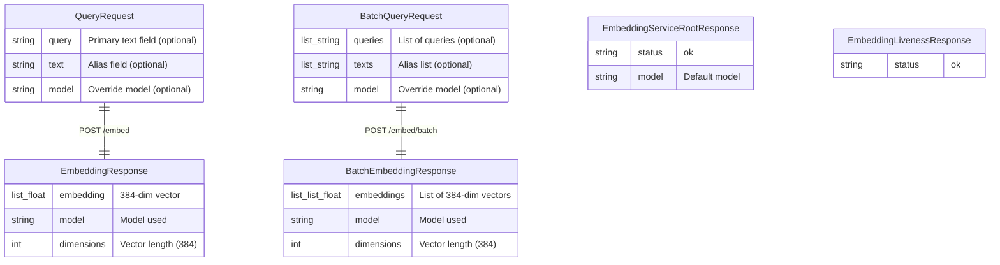
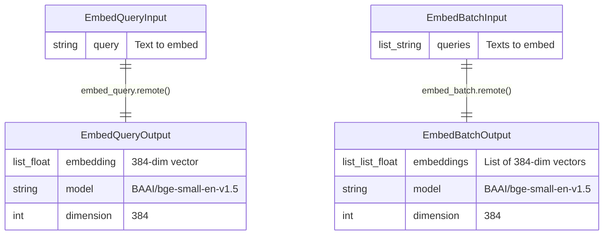
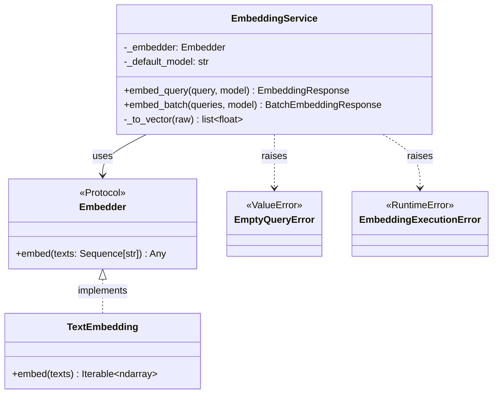

# Data Models Diagram: Embedding Worker
> Auto-generated: 2026-05-12

## Pydantic Schema Relationships

## Modal Function I/O (Dict-Based)

## Service Layer Types

See: [Data Models](../02-data-models.md)
