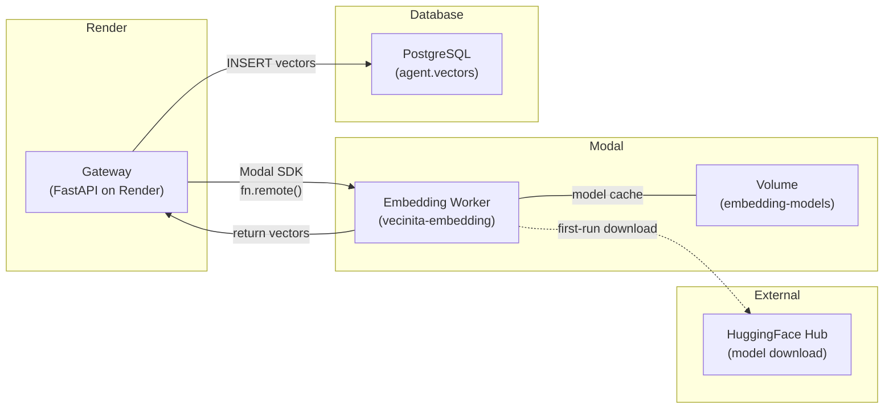
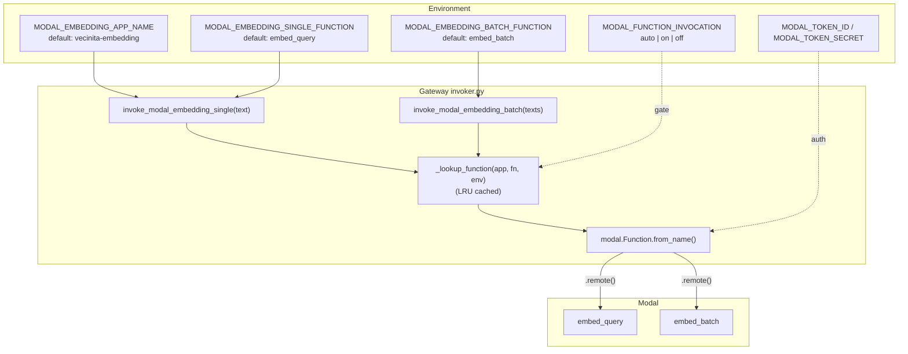
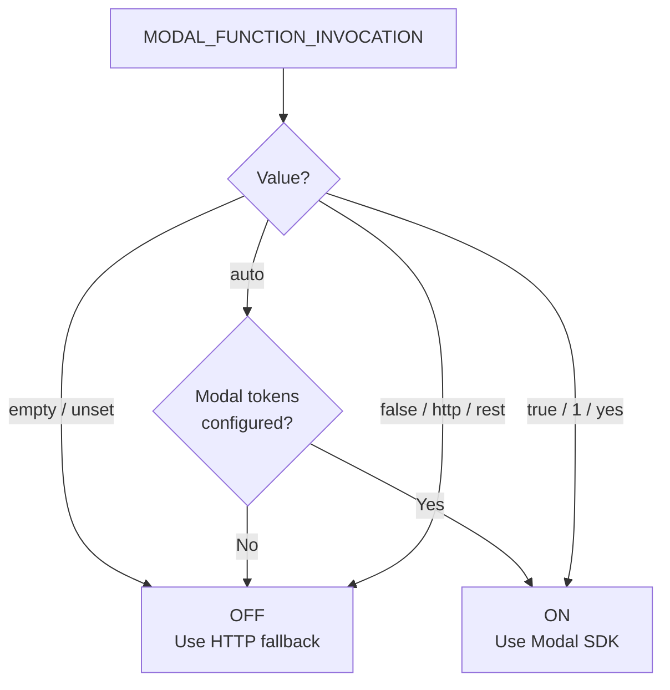

# Integration Points Diagram: Embedding Worker
> Auto-generated: 2026-05-12

## Service Connectivity

## Gateway Invocation Detail

## Invocation Mode Decision

See: [Integration Points](../03-integration-points.md)
