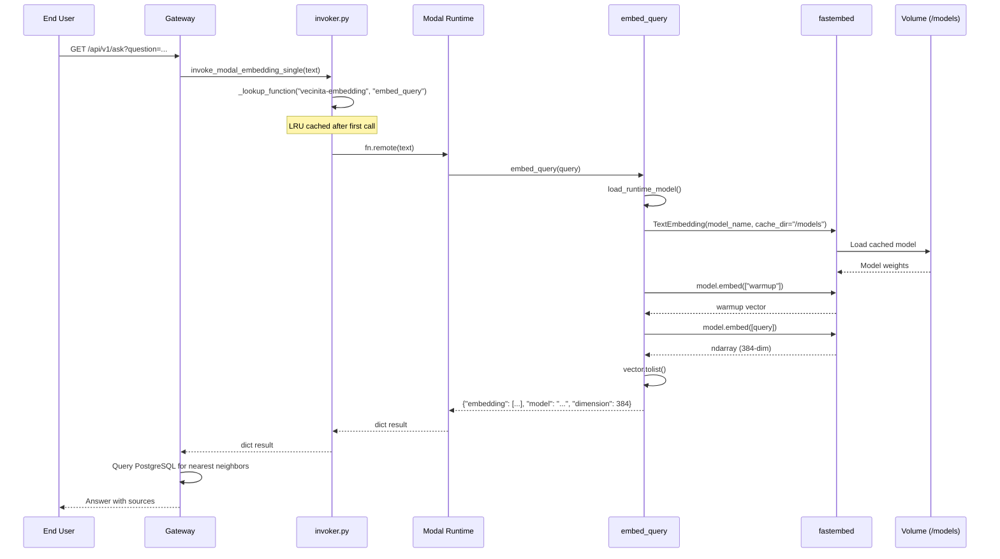
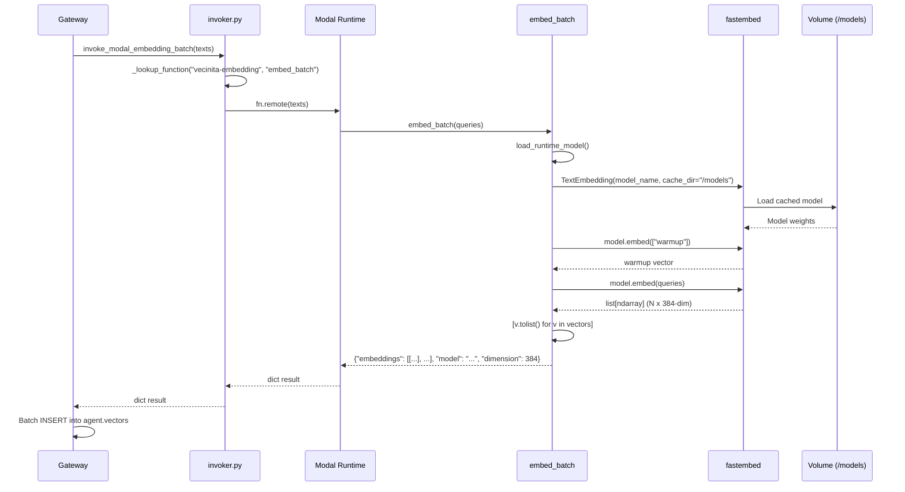
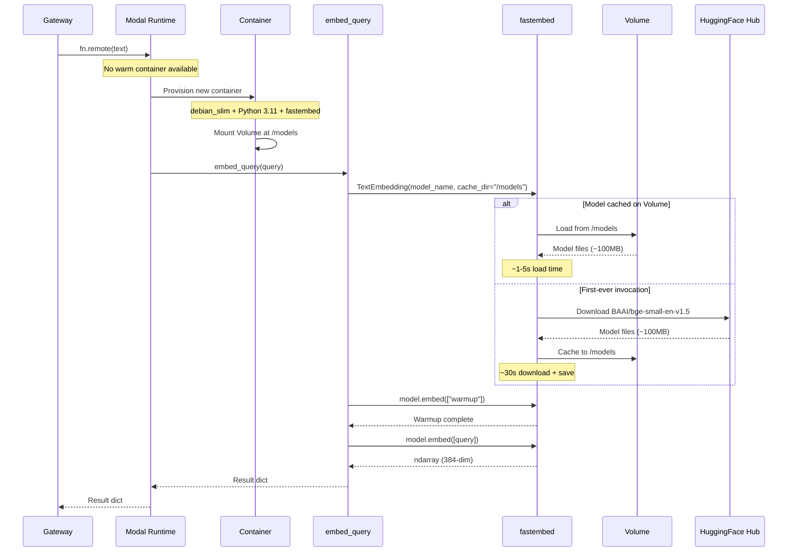
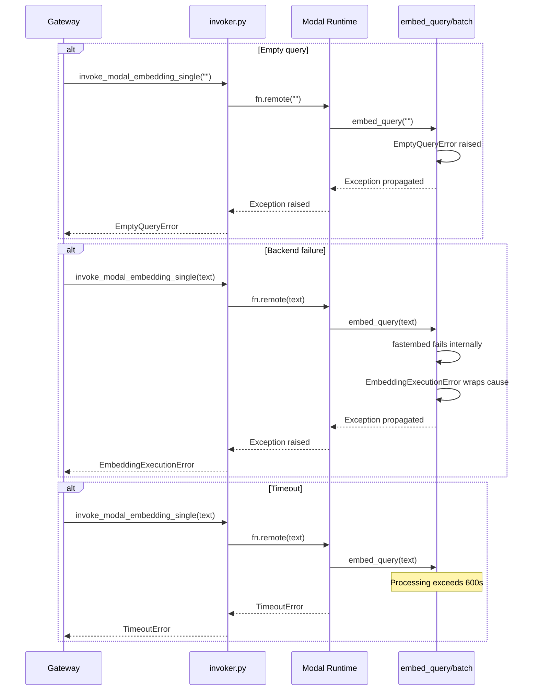
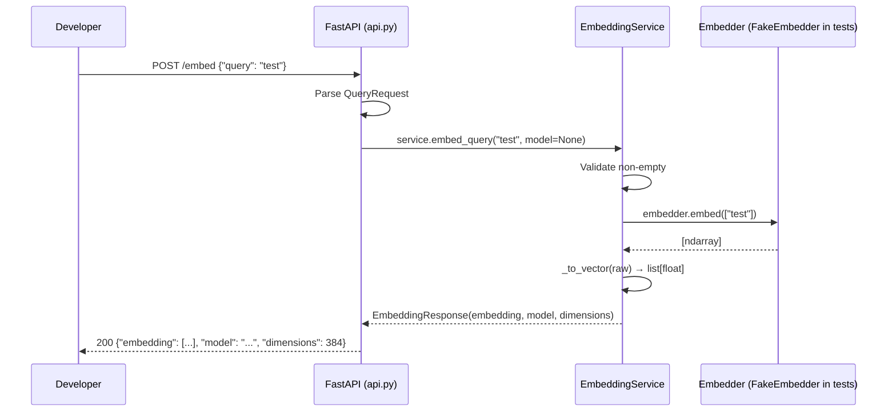

# Sequence Flows Diagram: Embedding Worker
> Auto-generated: 2026-05-12

## Single Embedding Request

## Batch Embedding Request

## Cold Start Sequence

## Error Handling Sequence

## HTTP API Sequence (Development)

See: [User Journeys](../05-user-journeys.md) | [Data Flow](../06-data-flow.md) | [API Contract](../08-api-contract.md)
