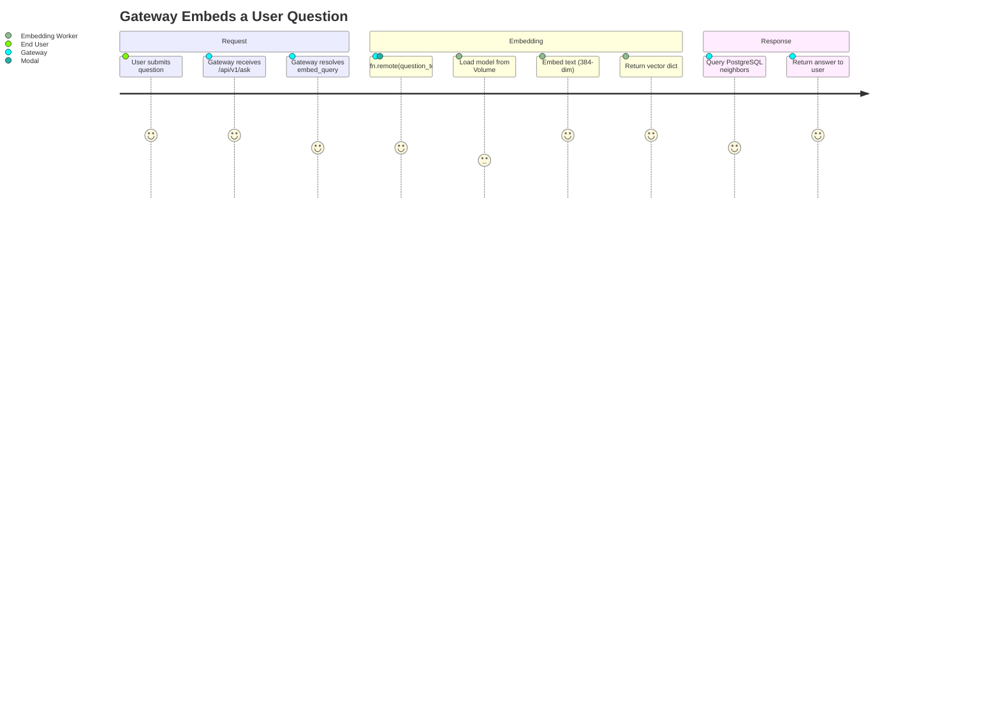
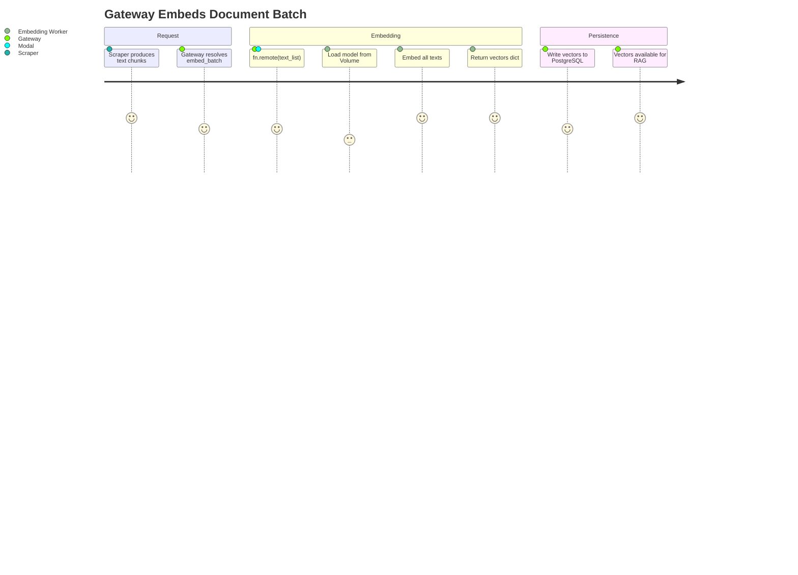
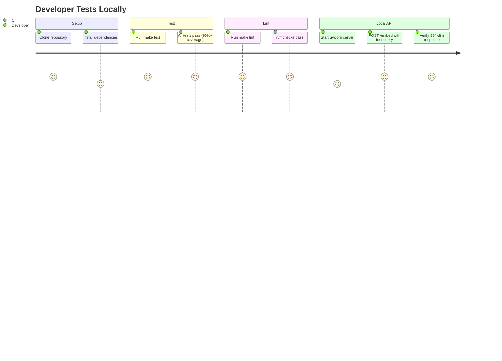
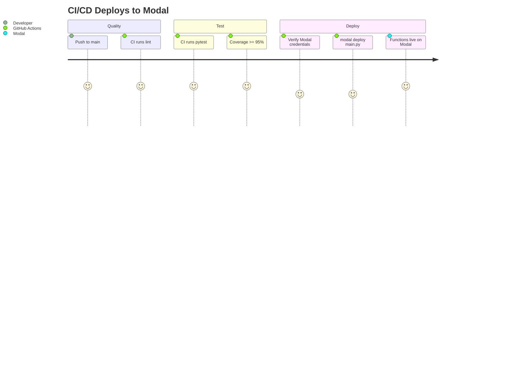
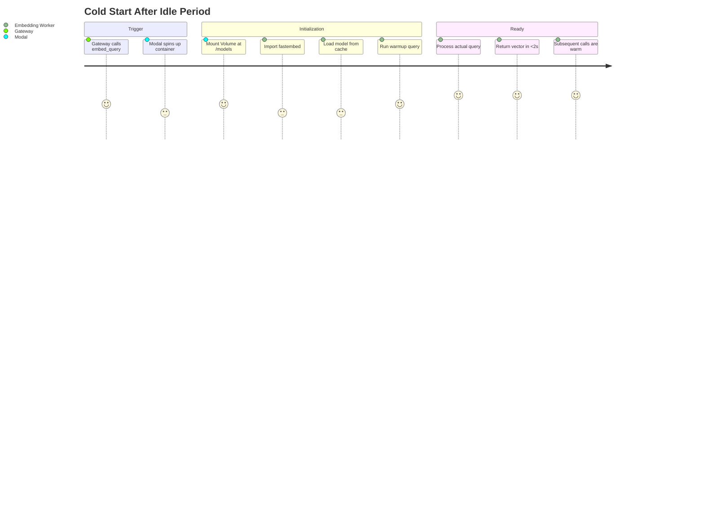

# User Journeys Diagram: Embedding Worker
> Auto-generated: 2026-05-12

## J1: Gateway Single Embedding Journey

## J2: Gateway Batch Embedding Journey

## J3: Developer Local Testing Journey

## J4: CI/CD Deploy Journey

## J5: Cold Start Recovery

See: [User Journeys](../05-user-journeys.md)
