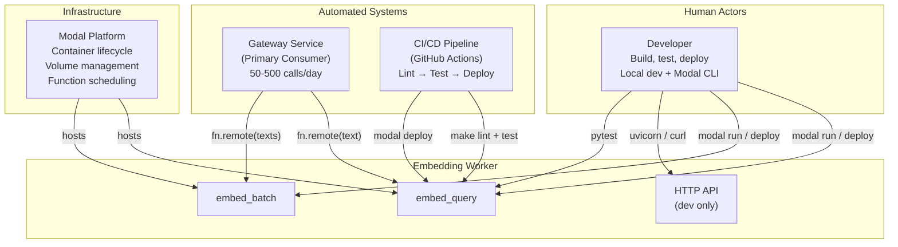
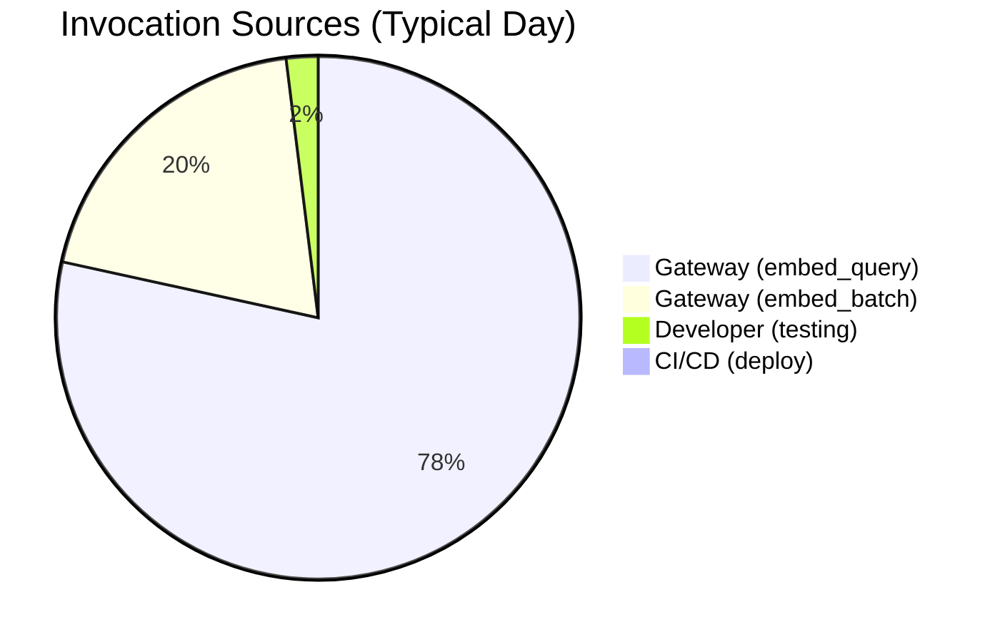
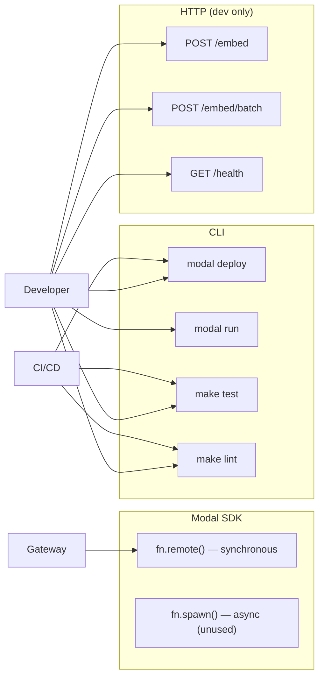

# User Personas Diagram: Embedding Worker
> Auto-generated: 2026-05-12

## Actor Relationship Diagram

```mermaid
graph TB
    subgraph "Automated Systems"
        GW["Gateway Service<br/>(Primary Consumer)<br/>50-500 calls/day"]
        CI["CI/CD Pipeline<br/>(GitHub Actions)<br/>Lint → Test → Deploy"]
    end

    subgraph "Human Actors"
        DEV["Developer<br/>Build, test, deploy<br/>Local dev + Modal CLI"]
    end

    subgraph "Infrastructure"
        MODAL["Modal Platform<br/>Container lifecycle<br/>Volume management<br/>Function scheduling"]
    end

    subgraph "Embedding Worker"
        EQ["embed_query"]
        EB["embed_batch"]
        HTTP["HTTP API<br/>(dev only)"]
    end

    GW -->|"fn.remote(text)"| EQ
    GW -->|"fn.remote(texts)"| EB
    DEV -->|"modal run / deploy"| EQ
    DEV -->|"modal run / deploy"| EB
    DEV -->|"uvicorn / curl"| HTTP
    DEV -->|"pytest"| EQ
    CI -->|"make lint + test"| EQ
    CI -->|"modal deploy"| EQ
    MODAL -->|"hosts"| EQ
    MODAL -->|"hosts"| EB
```

## Interaction Frequency

```mermaid
pie title Invocation Sources (Typical Day)
    "Gateway (embed_query)" : 400
    "Gateway (embed_batch)" : 100
    "Developer (testing)" : 10
    "CI/CD (deploy)" : 2
```

## Access Patterns

```mermaid
graph LR
    subgraph "Modal SDK"
        R1["fn.remote() — synchronous"]
        R2["fn.spawn() — async (unused)"]
    end

    subgraph "HTTP (dev only)"
        H1["POST /embed"]
        H2["POST /embed/batch"]
        H3["GET /health"]
    end

    subgraph "CLI"
        C1["modal deploy"]
        C2["modal run"]
        C3["make test"]
        C4["make lint"]
    end

    GW["Gateway"] --> R1
    DEV["Developer"] --> H1
    DEV --> H2
    DEV --> H3
    DEV --> C1
    DEV --> C2
    DEV --> C3
    DEV --> C4
    CI["CI/CD"] --> C3
    CI --> C4
    CI --> C1
```

See: [User Personas](../04-user-personas.md)
