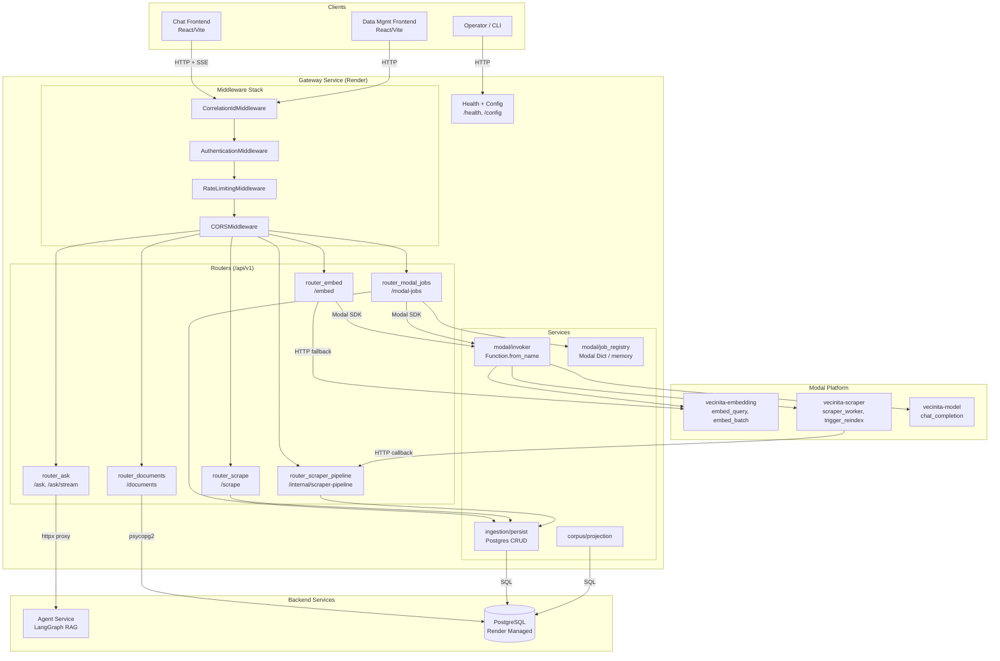
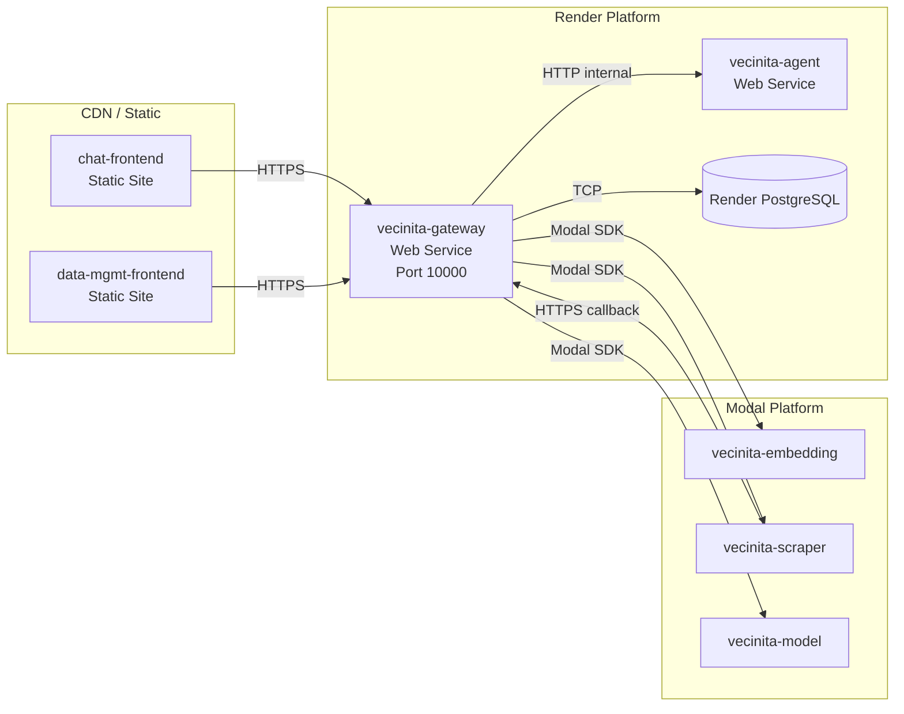

# Architecture Diagram: Gateway
> Auto-generated: 2026-05-12

## Component Diagram

```mermaid
graph TB
    subgraph "Clients"
        CF[Chat Frontend<br/>React/Vite]
        DMF[Data Mgmt Frontend<br/>React/Vite]
        OP[Operator / CLI]
    end

    subgraph "Gateway Service (Render)"
        subgraph "Middleware Stack"
            CID[CorrelationIdMiddleware]
            AUTH[AuthenticationMiddleware]
            RL[RateLimitingMiddleware]
            CORS[CORSMiddleware]
        end

        subgraph "Routers (/api/v1)"
            ASK[router_ask<br/>/ask, /ask/stream]
            SCRAPE[router_scrape<br/>/scrape]
            EMBED[router_embed<br/>/embed]
            MJ[router_modal_jobs<br/>/modal-jobs]
            DOCS[router_documents<br/>/documents]
            PIPE[router_scraper_pipeline<br/>/internal/scraper-pipeline]
        end

        subgraph "Services"
            INV[modal/invoker<br/>Function.from_name]
            REG[modal/job_registry<br/>Modal Dict / memory]
            PERSIST[ingestion/persist<br/>Postgres CRUD]
            CORPUS[corpus/projection]
        end

        HEALTH[Health + Config<br/>/health, /config]
    end

    subgraph "Backend Services"
        AGENT[Agent Service<br/>LangGraph RAG]
        PG[(PostgreSQL<br/>Render Managed)]
    end

    subgraph "Modal Platform"
        EMB_FN[vecinita-embedding<br/>embed_query, embed_batch]
        SCR_FN[vecinita-scraper<br/>scraper_worker, trigger_reindex]
        MOD_FN[vecinita-model<br/>chat_completion]
    end

    CF -->|HTTP + SSE| CID
    DMF -->|HTTP| CID
    OP -->|HTTP| HEALTH

    CID --> AUTH --> RL --> CORS

    CORS --> ASK
    CORS --> SCRAPE
    CORS --> EMBED
    CORS --> MJ
    CORS --> DOCS
    CORS --> PIPE

    ASK -->|httpx proxy| AGENT
    EMBED -->|Modal SDK| INV
    EMBED -->|HTTP fallback| EMB_FN
    MJ -->|Modal SDK| INV
    MJ --> PERSIST
    SCRAPE --> PERSIST
    DOCS -->|psycopg2| PG
    PIPE --> PERSIST

    INV --> EMB_FN
    INV --> SCR_FN
    INV --> MOD_FN
    MJ --> REG
    PERSIST -->|SQL| PG
    CORPUS -->|SQL| PG

    SCR_FN -->|HTTP callback| PIPE
```

## Deployment Diagram

```mermaid
graph LR
    subgraph "Render Platform"
        GW[vecinita-gateway<br/>Web Service<br/>Port 10000]
        AG[vecinita-agent<br/>Web Service]
        DB[(Render PostgreSQL)]
    end

    subgraph "Modal Platform"
        ME[vecinita-embedding]
        MS[vecinita-scraper]
        MM[vecinita-model]
    end

    subgraph "CDN / Static"
        FE[chat-frontend<br/>Static Site]
        DM[data-mgmt-frontend<br/>Static Site]
    end

    FE -->|HTTPS| GW
    DM -->|HTTPS| GW
    GW -->|HTTP internal| AG
    GW -->|TCP| DB
    GW -->|Modal SDK| ME
    GW -->|Modal SDK| MS
    GW -->|Modal SDK| MM
    MS -->|HTTPS callback| GW
```
