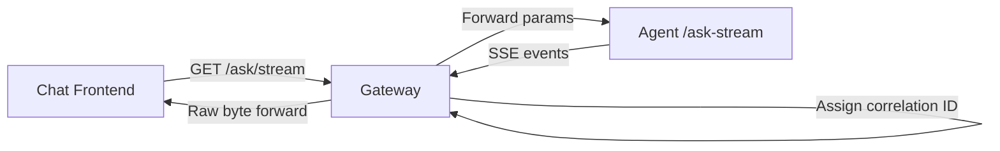
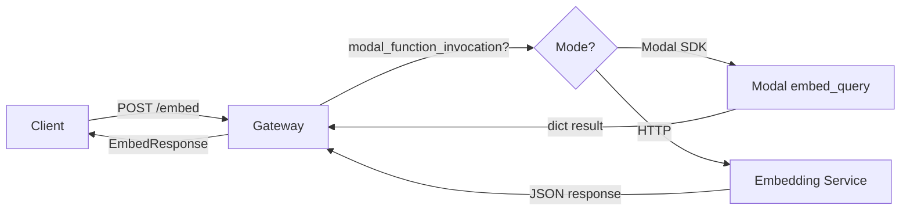
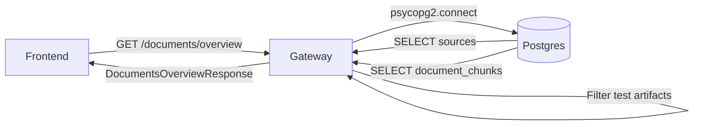
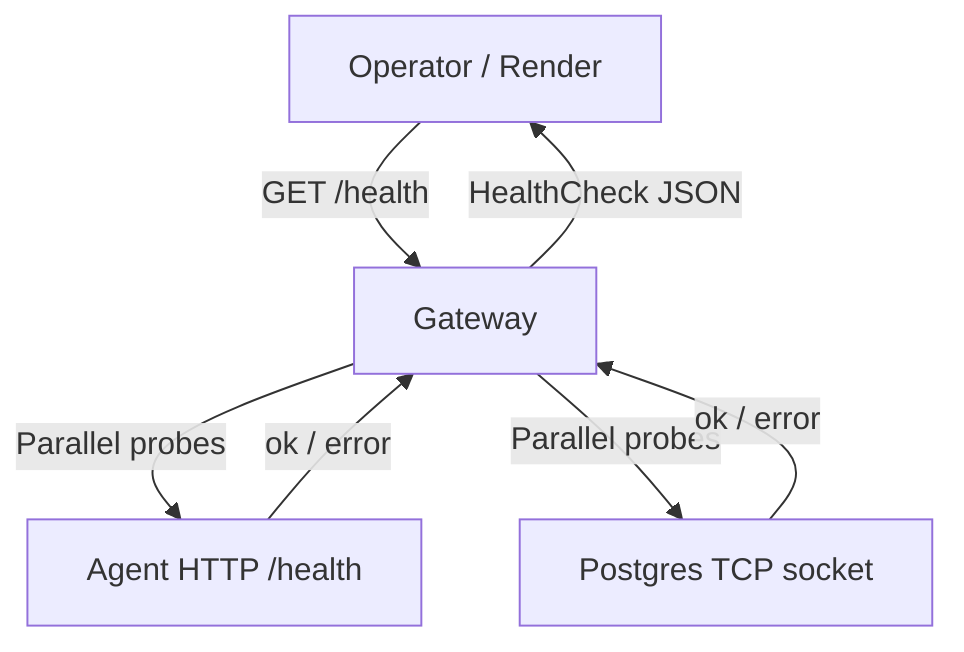

# Data Flow Diagrams: Gateway
> Auto-generated: 2026-05-12

## Q&A Request Flow



## Scrape Job Flow

```mermaid
flowchart TD
    A[Data Mgmt UI] -->|POST /modal-jobs/scraper| B[Gateway]
    B -->|Check dedup| DB[(Postgres)]
    B -->|Create job row| DB
    B -->|invoke_modal_scrape_job_submit| C[Modal scraper_worker]
    B -->|spawn trigger_reindex| D[Modal drain workers]

    C -->|POST /internal/scraper-pipeline/jobs/status| B
    C -->|POST /internal/scraper-pipeline/crawled-urls| B
    C -->|POST /internal/scraper-pipeline/chunks| B
    C -->|POST /internal/scraper-pipeline/embeddings| B
    B -->|UPDATE scraping_jobs| DB

    A -->|GET /modal-jobs/scraper/{id}| B
    B -->|SELECT scraping_jobs| DB
    B -->|Return status + pipeline_stage| A
```

## Embedding Flow



## Documents Read Flow



## Health Probe Flow


