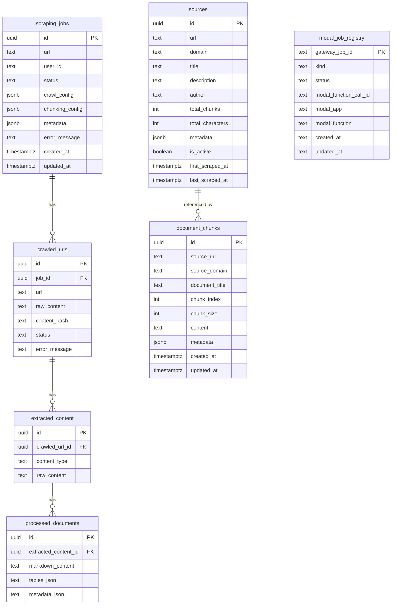
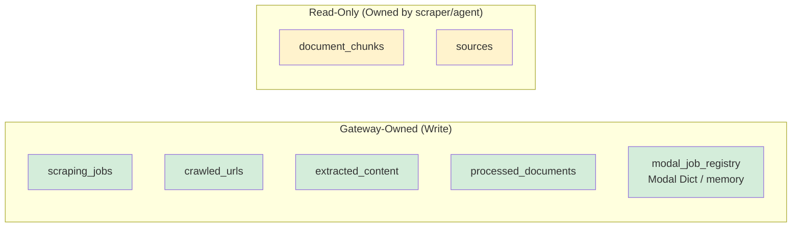

# Data Models Diagram: Gateway
> Auto-generated: 2026-05-12

## Entity Relationship Diagram

```mermaid
erDiagram
    scraping_jobs {
        uuid id PK
        text url
        text user_id
        text status
        jsonb crawl_config
        jsonb chunking_config
        jsonb metadata
        text error_message
        timestamptz created_at
        timestamptz updated_at
    }

    crawled_urls {
        uuid id PK
        uuid job_id FK
        text url
        text raw_content
        text content_hash
        text status
        text error_message
    }

    extracted_content {
        uuid id PK
        uuid crawled_url_id FK
        text content_type
        text raw_content
    }

    processed_documents {
        uuid id PK
        uuid extracted_content_id FK
        text markdown_content
        text tables_json
        text metadata_json
    }

    document_chunks {
        uuid id PK
        text source_url
        text source_domain
        text document_title
        int chunk_index
        int chunk_size
        text content
        jsonb metadata
        timestamptz created_at
        timestamptz updated_at
    }

    sources {
        uuid id PK
        text url
        text domain
        text title
        text description
        text author
        int total_chunks
        int total_characters
        jsonb metadata
        boolean is_active
        timestamptz first_scraped_at
        timestamptz last_scraped_at
    }

    modal_job_registry {
        text gateway_job_id PK
        text kind
        text status
        text modal_function_call_id
        text modal_app
        text modal_function
        text created_at
        text updated_at
    }

    scraping_jobs ||--o{ crawled_urls : "has"
    crawled_urls ||--o{ extracted_content : "has"
    extracted_content ||--o{ processed_documents : "has"
    sources ||--o{ document_chunks : "referenced by"
```

## Ownership Legend

```mermaid
graph LR
    subgraph "Gateway-Owned (Write)"
        SJ[scraping_jobs]
        CU[crawled_urls]
        EC[extracted_content]
        PD[processed_documents]
        MJR[modal_job_registry<br/>Modal Dict / memory]
    end

    subgraph "Read-Only (Owned by scraper/agent)"
        DC[document_chunks]
        SR[sources]
    end

    style SJ fill:#d4edda
    style CU fill:#d4edda
    style EC fill:#d4edda
    style PD fill:#d4edda
    style MJR fill:#d4edda
    style DC fill:#fff3cd
    style SR fill:#fff3cd
```
