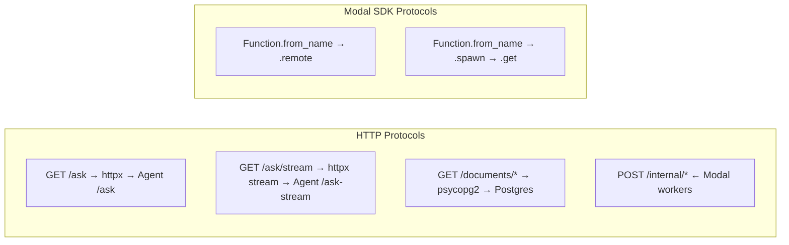
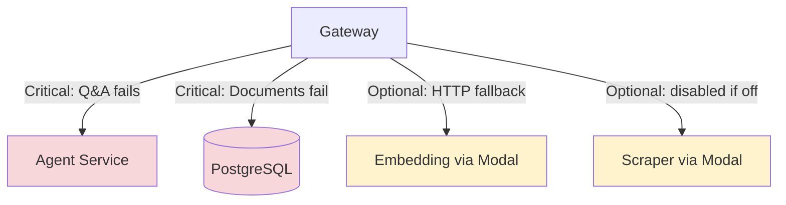

# Integration Points Diagram: Gateway
> Auto-generated: 2026-05-12

## Service Connectivity Graph

```mermaid
graph TD
    subgraph "Inbound"
        CF[Chat Frontend]
        DMF[Data Mgmt Frontend]
        MW[Modal Scraper Workers]
    end

    GW[Gateway<br/>FastAPI on Render]

    subgraph "Outbound"
        AG[Agent Service<br/>HTTP REST]
        PG[(PostgreSQL<br/>Render Managed)]
        ME[Modal: embedding<br/>embed_query / embed_batch]
        MS[Modal: scraper<br/>scrape_job_submit / reindex]
        MM[Modal: model<br/>chat_completion]
    end

    CF -->|HTTP + SSE<br/>Bearer auth| GW
    DMF -->|HTTP<br/>Bearer auth| GW
    MW -->|HTTP<br/>X-Scraper-Pipeline-Ingest-Token| GW

    GW -->|httpx AsyncClient<br/>180s timeout| AG
    GW -->|psycopg2<br/>5s connect, 30s stmt| PG
    GW -->|Modal SDK .remote()<br/>via asyncio.to_thread| ME
    GW -->|Modal SDK .remote()/.spawn()| MS
    GW -->|Modal SDK .remote()| MM
```

## Protocol Details



## Dependency Criticality


