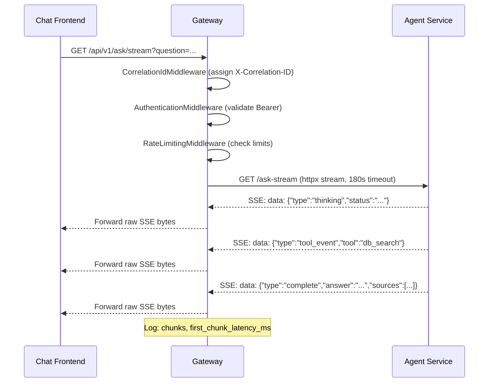
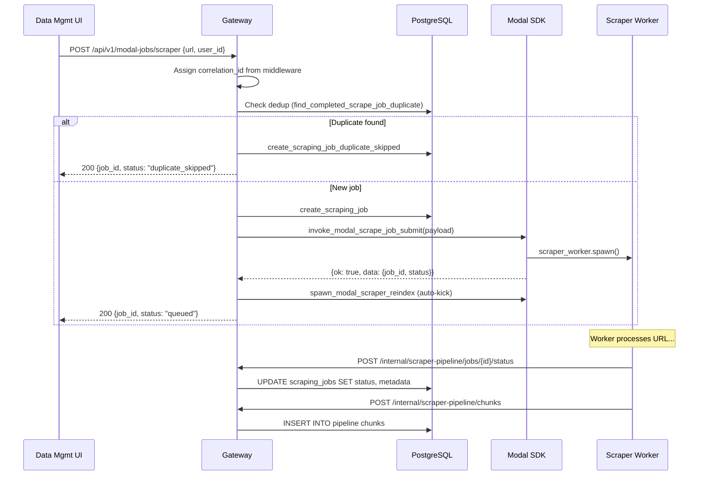
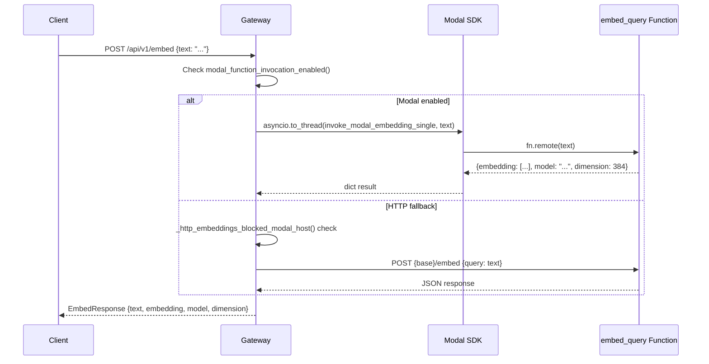
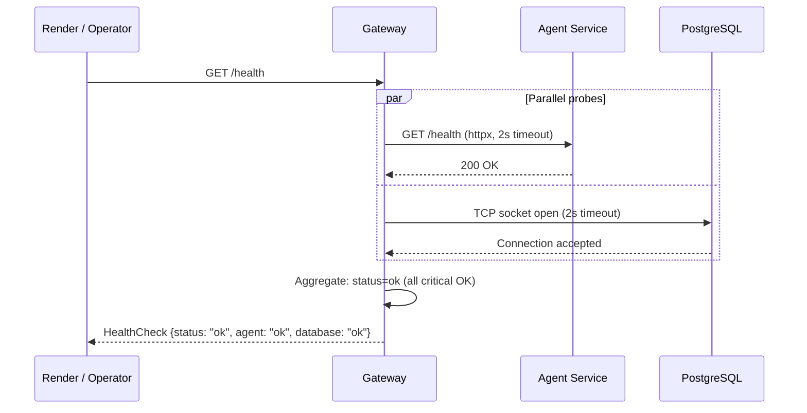

# Sequence Flow Diagrams: Gateway
> Auto-generated: 2026-05-12

## SSE Streaming Q&A

```mermaid
sequenceDiagram
    participant F as Chat Frontend
    participant GW as Gateway
    participant A as Agent Service

    F->>GW: GET /api/v1/ask/stream?question=...
    GW->>GW: CorrelationIdMiddleware (assign X-Correlation-ID)
    GW->>GW: AuthenticationMiddleware (validate Bearer)
    GW->>GW: RateLimitingMiddleware (check limits)
    GW->>A: GET /ask-stream (httpx stream, 180s timeout)
    A-->>GW: SSE: data: {"type":"thinking","status":"..."}
    GW-->>F: Forward raw SSE bytes
    A-->>GW: SSE: data: {"type":"tool_event","tool":"db_search"}
    GW-->>F: Forward raw SSE bytes
    A-->>GW: SSE: data: {"type":"complete","answer":"...","sources":[...]}
    GW-->>F: Forward raw SSE bytes
    Note over GW: Log: chunks, first_chunk_latency_ms
```

## Modal Scrape Job Submit

```mermaid
sequenceDiagram
    participant UI as Data Mgmt UI
    participant GW as Gateway
    participant PG as PostgreSQL
    participant M as Modal SDK
    participant SW as Scraper Worker

    UI->>GW: POST /api/v1/modal-jobs/scraper {url, user_id}
    GW->>GW: Assign correlation_id from middleware
    GW->>PG: Check dedup (find_completed_scrape_job_duplicate)
    alt Duplicate found
        GW->>PG: create_scraping_job_duplicate_skipped
        GW-->>UI: 200 {job_id, status: "duplicate_skipped"}
    else New job
        GW->>PG: create_scraping_job
        GW->>M: invoke_modal_scrape_job_submit(payload)
        M->>SW: scraper_worker.spawn()
        M-->>GW: {ok: true, data: {job_id, status}}
        GW->>M: spawn_modal_scraper_reindex (auto-kick)
        GW-->>UI: 200 {job_id, status: "queued"}
    end

    Note over SW: Worker processes URL...
    SW->>GW: POST /internal/scraper-pipeline/jobs/{id}/status
    GW->>PG: UPDATE scraping_jobs SET status, metadata
    SW->>GW: POST /internal/scraper-pipeline/chunks
    GW->>PG: INSERT INTO pipeline chunks
```

## Embedding via Modal

```mermaid
sequenceDiagram
    participant C as Client
    participant GW as Gateway
    participant M as Modal SDK
    participant EF as embed_query Function

    C->>GW: POST /api/v1/embed {text: "..."}
    GW->>GW: Check modal_function_invocation_enabled()
    alt Modal enabled
        GW->>M: asyncio.to_thread(invoke_modal_embedding_single, text)
        M->>EF: fn.remote(text)
        EF-->>M: {embedding: [...], model: "...", dimension: 384}
        M-->>GW: dict result
    else HTTP fallback
        GW->>GW: _http_embeddings_blocked_modal_host() check
        GW->>EF: POST {base}/embed {query: text}
        EF-->>GW: JSON response
    end
    GW-->>C: EmbedResponse {text, embedding, model, dimension}
```

## Health Check

```mermaid
sequenceDiagram
    participant R as Render / Operator
    participant GW as Gateway
    participant A as Agent Service
    participant PG as PostgreSQL

    R->>GW: GET /health
    par Parallel probes
        GW->>A: GET /health (httpx, 2s timeout)
        A-->>GW: 200 OK
    and
        GW->>PG: TCP socket open (2s timeout)
        PG-->>GW: Connection accepted
    end
    GW->>GW: Aggregate: status=ok (all critical OK)
    GW-->>R: HealthCheck {status: "ok", agent: "ok", database: "ok"}
```
