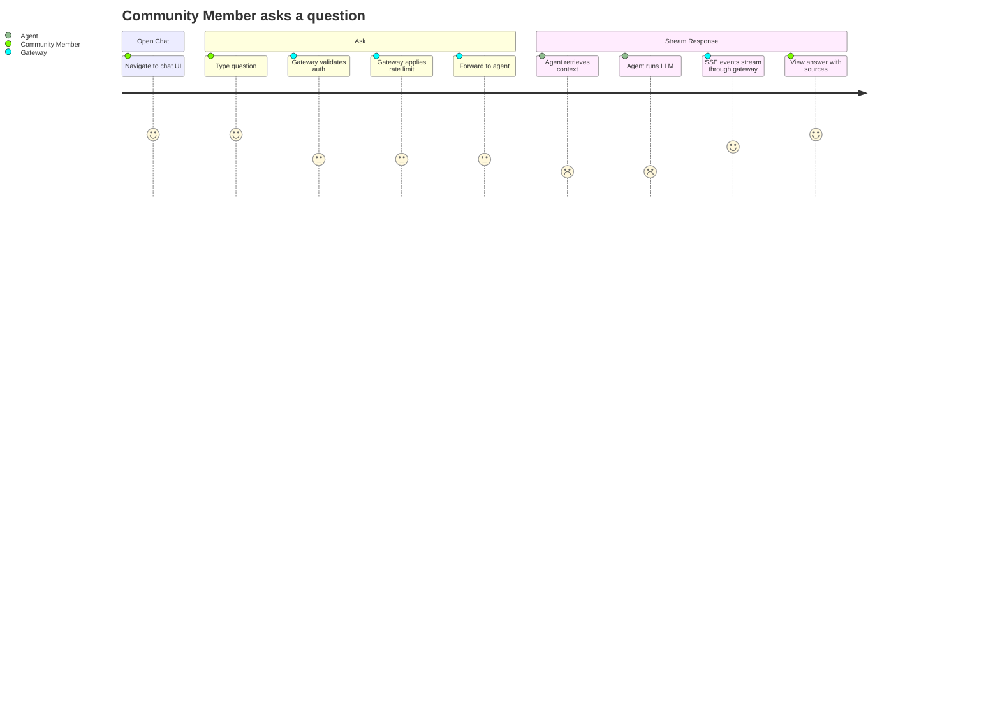
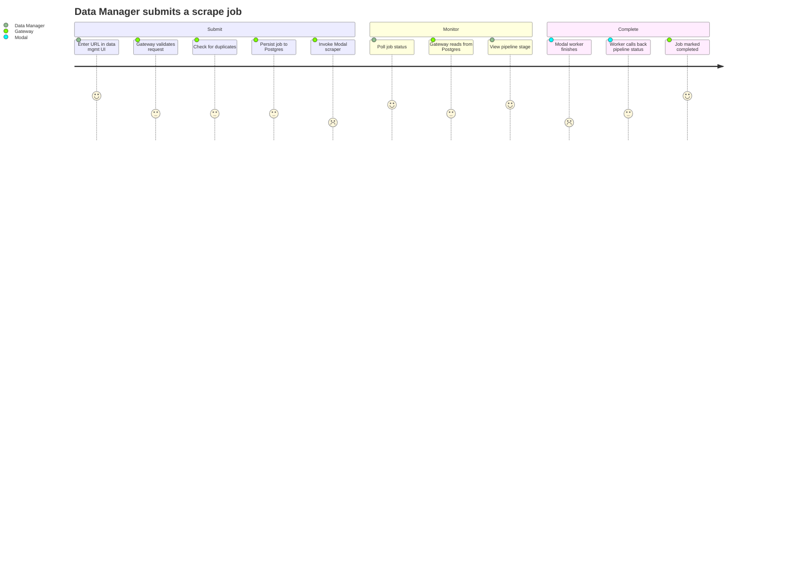
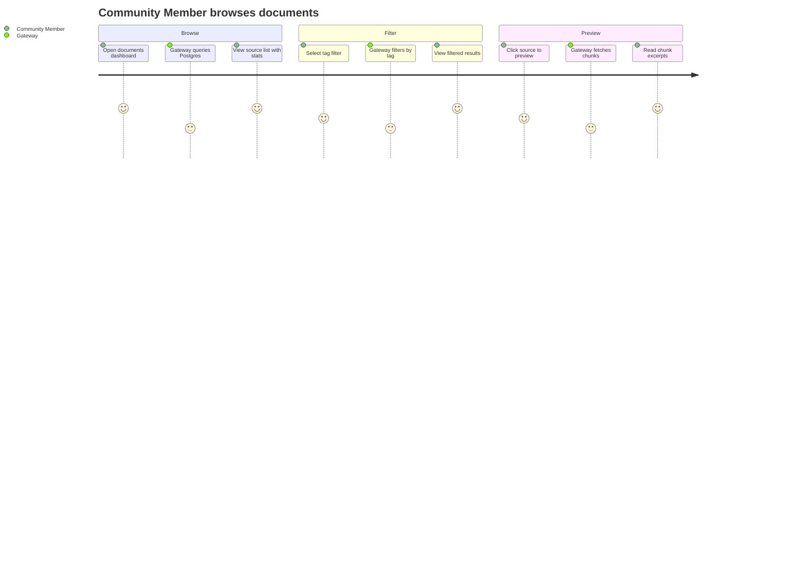
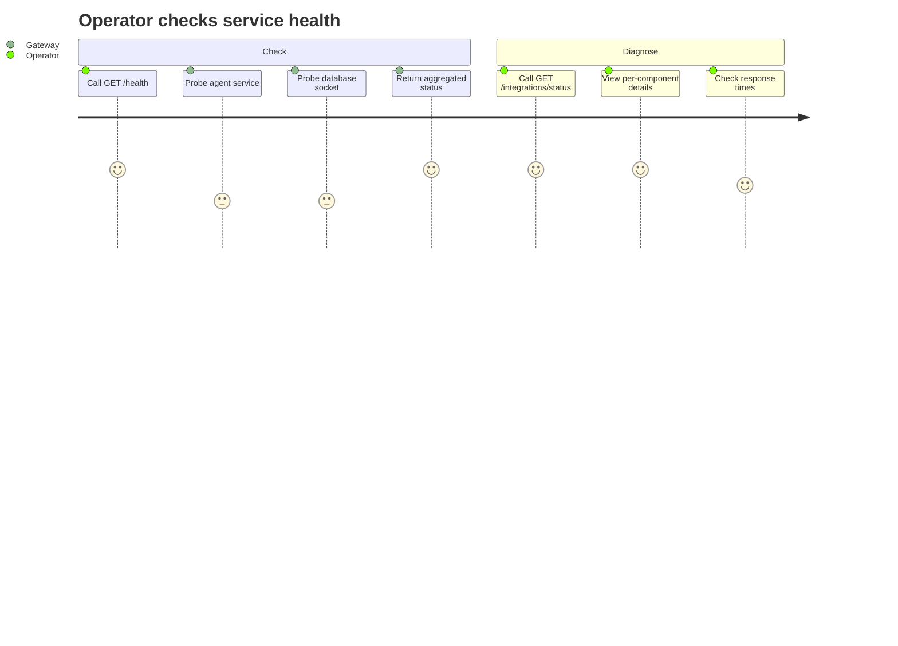

# User Journey Diagrams: Gateway
> Auto-generated: 2026-05-12

## Journey 1: Ask a Question

```mermaid
journey
    title Community Member asks a question
    section Open Chat
        Navigate to chat UI: 5: Community Member
    section Ask
        Type question: 5: Community Member
        Gateway validates auth: 3: Gateway
        Gateway applies rate limit: 3: Gateway
        Forward to agent: 3: Gateway
    section Stream Response
        Agent retrieves context: 2: Agent
        Agent runs LLM: 2: Agent
        SSE events stream through gateway: 4: Gateway
        View answer with sources: 5: Community Member
```

## Journey 2: Submit Scrape Job

```mermaid
journey
    title Data Manager submits a scrape job
    section Submit
        Enter URL in data mgmt UI: 5: Data Manager
        Gateway validates request: 3: Gateway
        Check for duplicates: 3: Gateway
        Persist job to Postgres: 3: Gateway
        Invoke Modal scraper: 2: Gateway
    section Monitor
        Poll job status: 4: Data Manager
        Gateway reads from Postgres: 3: Gateway
        View pipeline stage: 4: Data Manager
    section Complete
        Modal worker finishes: 2: Modal
        Worker calls back pipeline status: 3: Modal
        Job marked completed: 5: Gateway
```

## Journey 3: Browse Documents

```mermaid
journey
    title Community Member browses documents
    section Browse
        Open documents dashboard: 5: Community Member
        Gateway queries Postgres: 3: Gateway
        View source list with stats: 5: Community Member
    section Filter
        Select tag filter: 4: Community Member
        Gateway filters by tag: 3: Gateway
        View filtered results: 5: Community Member
    section Preview
        Click source to preview: 4: Community Member
        Gateway fetches chunks: 3: Gateway
        Read chunk excerpts: 5: Community Member
```

## Journey 4: Monitor Health

```mermaid
journey
    title Operator checks service health
    section Check
        Call GET /health: 5: Operator
        Probe agent service: 3: Gateway
        Probe database socket: 3: Gateway
        Return aggregated status: 5: Gateway
    section Diagnose
        Call GET /integrations/status: 5: Operator
        View per-component details: 5: Operator
        Check response times: 4: Operator
```
