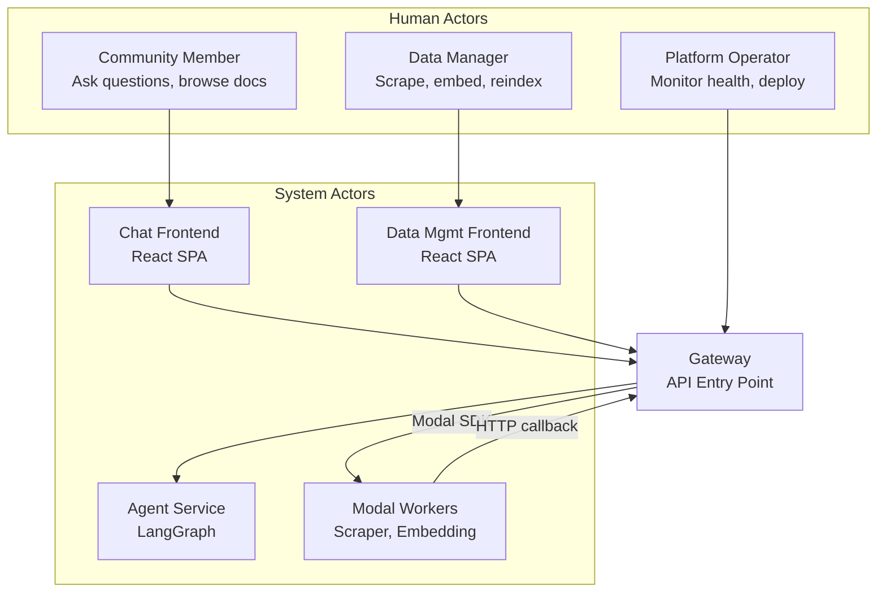

# User Personas Diagram: Gateway
> Auto-generated: 2026-05-12

## Actor Relationship Diagram



## Persona → Endpoint Mapping

```mermaid
graph LR
    subgraph "Community Member"
        E1[/ask]
        E2[/ask/stream]
        E3[/documents/overview]
        E4[/documents/preview]
        E5[/documents/tags]
    end

    subgraph "Data Manager"
        E6[/modal-jobs/scraper]
        E7[/scrape]
        E8[/embed]
        E9[/modal-jobs/reindex/spawn]
    end

    subgraph "Platform Operator"
        E10[/health]
        E11[/integrations/status]
        E12[/config]
    end

    subgraph "Modal Workers"
        E13[/internal/scraper-pipeline/*]
    end
```
