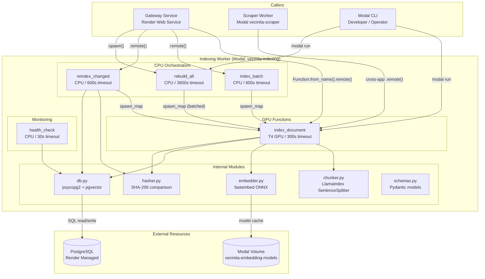
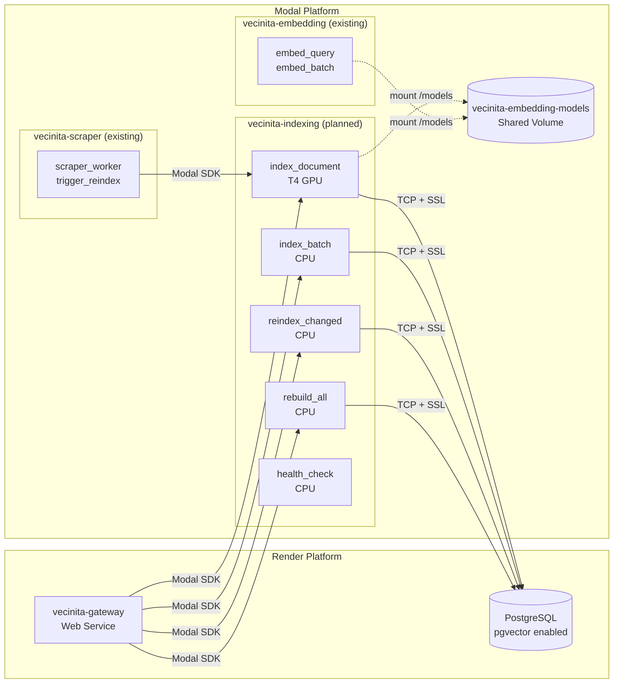

# Architecture Diagram: Indexing Worker
> Auto-generated: 2026-05-12

## Component Diagram

```mermaid
graph TB
    subgraph "Callers"
        GW[Gateway Service<br/>Render Web Service]
        SCR[Scraper Worker<br/>Modal vecinita-scraper]
        CLI[Modal CLI<br/>Developer / Operator]
    end

    subgraph "Indexing Worker (Modal: vecinita-indexing)"
        subgraph "GPU Functions"
            IDX[index_document<br/>T4 GPU / 300s timeout]
        end

        subgraph "CPU Orchestrators"
            BATCH[index_batch<br/>CPU / 600s timeout]
            REINDEX[reindex_changed<br/>CPU / 600s timeout]
            REBUILD[rebuild_all<br/>CPU / 3600s timeout]
        end

        subgraph "Monitoring"
            HC[health_check<br/>CPU / 30s timeout]
        end

        subgraph "Internal Modules"
            CHUNK[chunker.py<br/>LlamaIndex SentenceSplitter]
            EMBED[embedder.py<br/>fastembed ONNX]
            DB[db.py<br/>psycopg2 + pgvector]
            HASH[hasher.py<br/>SHA-256 comparison]
            SCHEMA[schemas.py<br/>Pydantic models]
        end
    end

    subgraph "External Resources"
        PG[(PostgreSQL<br/>Render Managed)]
        VOL[(Modal Volume<br/>vecinita-embedding-models)]
    end

    GW -->|"Function.from_name().remote()"| IDX
    GW -->|".remote()"| BATCH
    GW -->|".remote()"| REINDEX
    GW -->|".spawn()"| REBUILD
    SCR -->|"cross-app .remote()"| IDX
    CLI -->|"modal run"| IDX
    CLI -->|"modal run"| REBUILD

    BATCH -->|"spawn_map"| IDX
    REINDEX -->|"spawn_map"| IDX
    REBUILD -->|"spawn_map (batched)"| IDX

    IDX --> CHUNK
    IDX --> EMBED
    IDX --> DB
    IDX --> HASH

    REINDEX --> HASH
    REINDEX --> DB

    DB -->|"SQL read/write"| PG
    EMBED -->|"model cache"| VOL
    HC --> DB
```

## Deployment Diagram

```mermaid
graph LR
    subgraph "Render Platform"
        GW[vecinita-gateway<br/>Web Service]
        PG[(PostgreSQL<br/>pgvector enabled)]
    end

    subgraph "Modal Platform"
        subgraph "vecinita-indexing (planned)"
            IDX_FN[index_document<br/>T4 GPU]
            BATCH_FN[index_batch<br/>CPU]
            REINDEX_FN[reindex_changed<br/>CPU]
            REBUILD_FN[rebuild_all<br/>CPU]
            HEALTH_FN[health_check<br/>CPU]
        end

        subgraph "vecinita-embedding (existing)"
            EMB[embed_query<br/>embed_batch]
        end

        subgraph "vecinita-scraper (existing)"
            SCRAPER[scraper_worker<br/>trigger_reindex]
        end

        VOL[(vecinita-embedding-models<br/>Shared Volume)]
    end

    GW -->|Modal SDK| IDX_FN
    GW -->|Modal SDK| BATCH_FN
    GW -->|Modal SDK| REINDEX_FN
    GW -->|Modal SDK| REBUILD_FN

    SCRAPER -->|Modal SDK| IDX_FN

    IDX_FN -->|TCP + SSL| PG
    BATCH_FN -->|TCP + SSL| PG
    REINDEX_FN -->|TCP + SSL| PG
    REBUILD_FN -->|TCP + SSL| PG

    IDX_FN -.->|mount /models| VOL
    EMB -.->|mount /models| VOL
```
