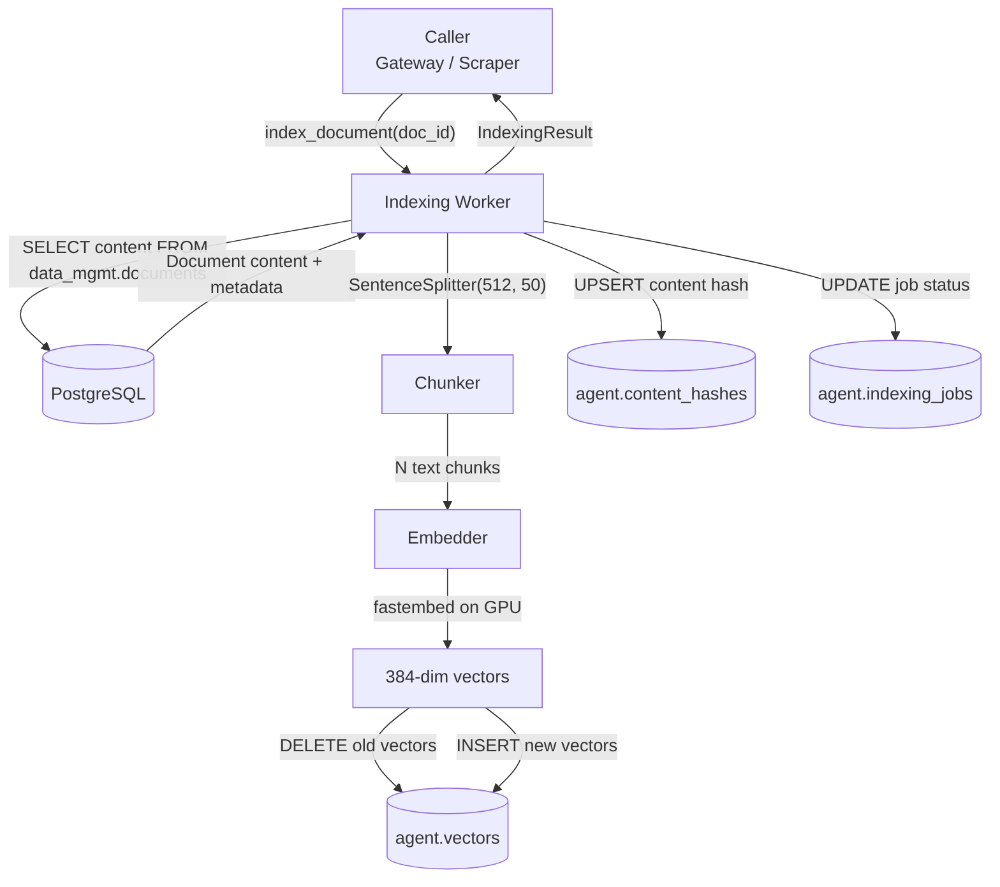
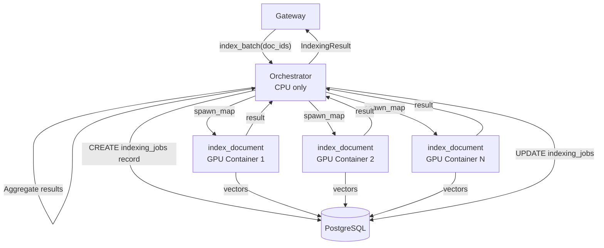
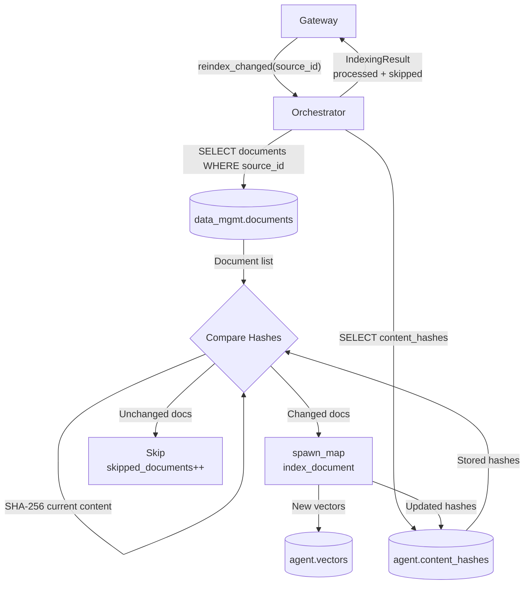
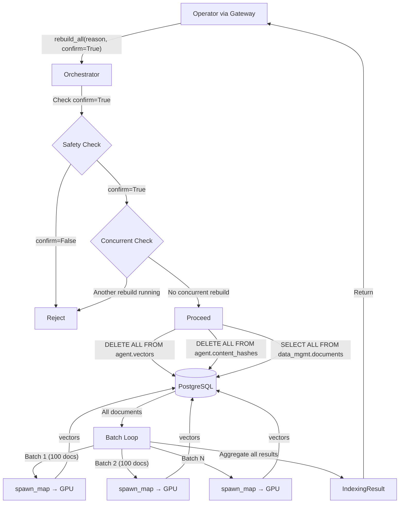
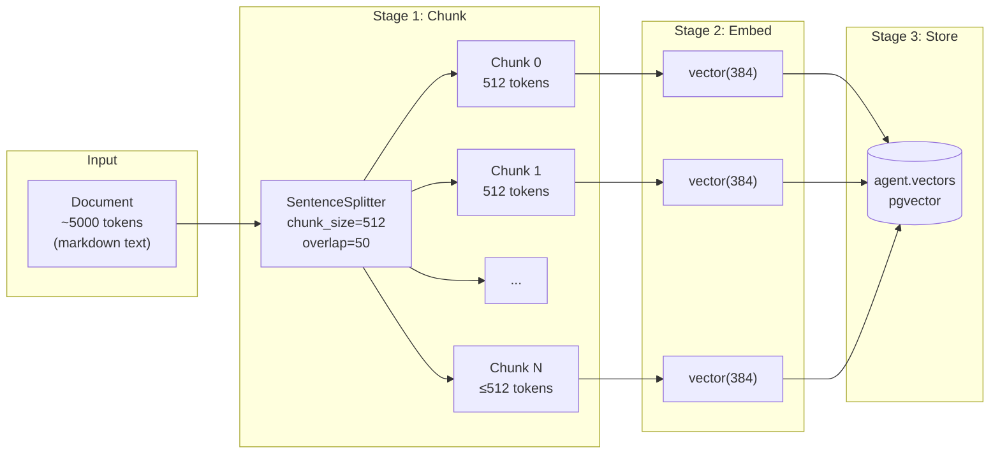

# Data Flow Diagrams: Indexing Worker
> Auto-generated: 2026-05-12

## Single-Document Indexing Pipeline

## Batch Indexing Flow

## Selective Re-Indexing Flow

## Full Rebuild Flow

## Document-to-Vector Transformation Detail

