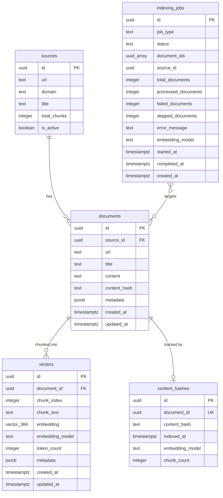
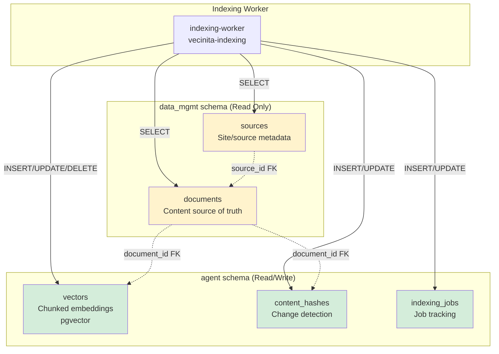
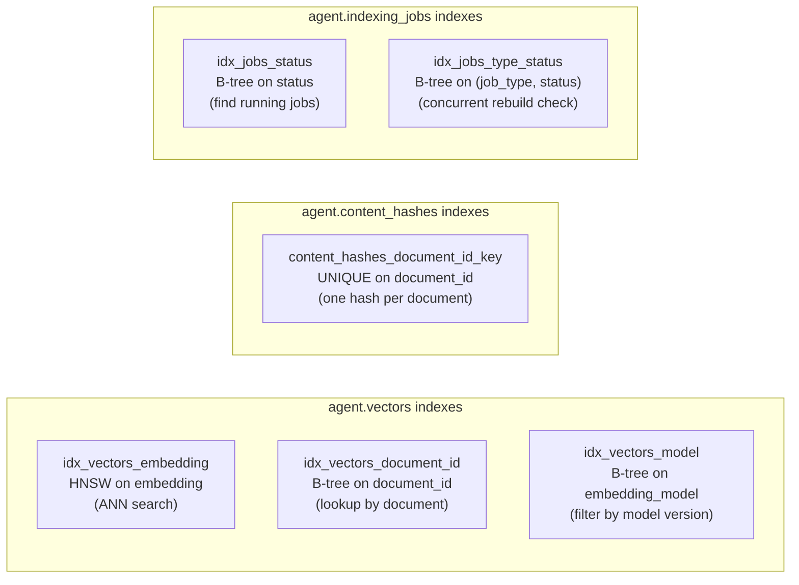

# Data Models Diagram: Indexing Worker
> Auto-generated: 2026-05-12

## Entity Relationship Diagram

```mermaid
erDiagram
    documents {
        uuid id PK
        uuid source_id FK
        text url
        text title
        text content
        text content_hash
        jsonb metadata
        timestamptz created_at
        timestamptz updated_at
    }

    vectors {
        uuid id PK
        uuid document_id FK
        integer chunk_index
        text chunk_text
        vector_384 embedding
        text embedding_model
        integer token_count
        jsonb metadata
        timestamptz created_at
        timestamptz updated_at
    }

    content_hashes {
        uuid id PK
        uuid document_id UK
        text content_hash
        timestamptz indexed_at
        text embedding_model
        integer chunk_count
    }

    indexing_jobs {
        uuid id PK
        text job_type
        text status
        uuid_array document_ids
        uuid source_id
        integer total_documents
        integer processed_documents
        integer failed_documents
        integer skipped_documents
        text error_message
        text embedding_model
        timestamptz started_at
        timestamptz completed_at
        timestamptz created_at
    }

    sources {
        uuid id PK
        text url
        text domain
        text title
        integer total_chunks
        boolean is_active
    }

    sources ||--o{ documents : "has"
    documents ||--o{ vectors : "chunked into"
    documents ||--o| content_hashes : "tracked by"
    indexing_jobs }o--o{ documents : "targets"
```

## Schema Ownership Diagram

```mermaid
graph TB
    subgraph "data_mgmt schema (Read Only)"
        DOCS[documents<br/>Content source of truth]
        SRC[sources<br/>Site/source metadata]
    end

    subgraph "agent schema (Read/Write)"
        VEC[vectors<br/>Chunked embeddings<br/>pgvector]
        HASH[content_hashes<br/>Change detection]
        JOBS[indexing_jobs<br/>Job tracking]
    end

    subgraph "Indexing Worker"
        IW[indexing-worker<br/>vecinita-indexing]
    end

    IW -->|"SELECT"| DOCS
    IW -->|"SELECT"| SRC
    IW -->|"INSERT/UPDATE/DELETE"| VEC
    IW -->|"INSERT/UPDATE"| HASH
    IW -->|"INSERT/UPDATE"| JOBS

    DOCS -.->|"document_id FK"| VEC
    DOCS -.->|"document_id FK"| HASH
    SRC -.->|"source_id FK"| DOCS

    style DOCS fill:#fff3cd
    style SRC fill:#fff3cd
    style VEC fill:#d4edda
    style HASH fill:#d4edda
    style JOBS fill:#d4edda
```

## Index Structure

```mermaid
graph LR
    subgraph "agent.vectors indexes"
        IDX1["idx_vectors_embedding<br/>HNSW on embedding<br/>(ANN search)"]
        IDX2["idx_vectors_document_id<br/>B-tree on document_id<br/>(lookup by document)"]
        IDX3["idx_vectors_model<br/>B-tree on embedding_model<br/>(filter by model version)"]
    end

    subgraph "agent.content_hashes indexes"
        IDX4["content_hashes_document_id_key<br/>UNIQUE on document_id<br/>(one hash per document)"]
    end

    subgraph "agent.indexing_jobs indexes"
        IDX5["idx_jobs_status<br/>B-tree on status<br/>(find running jobs)"]
        IDX6["idx_jobs_type_status<br/>B-tree on (job_type, status)<br/>(concurrent rebuild check)"]
    end
```
