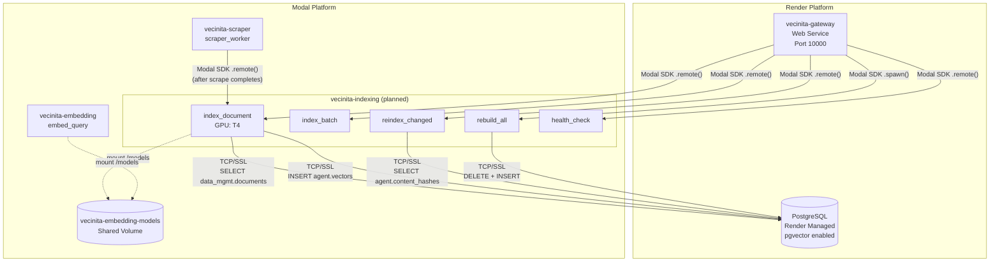
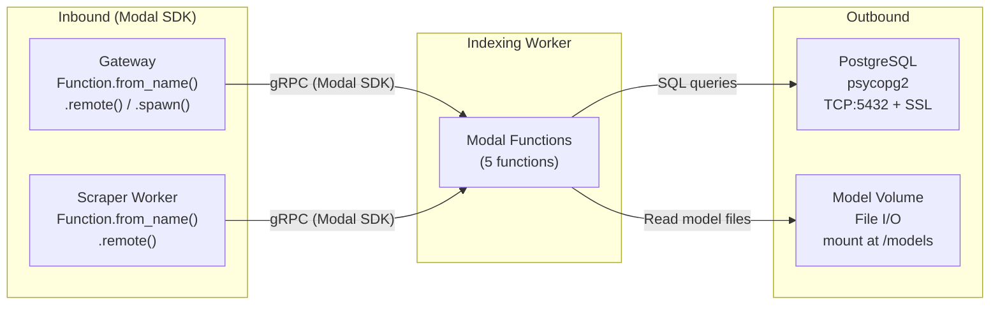
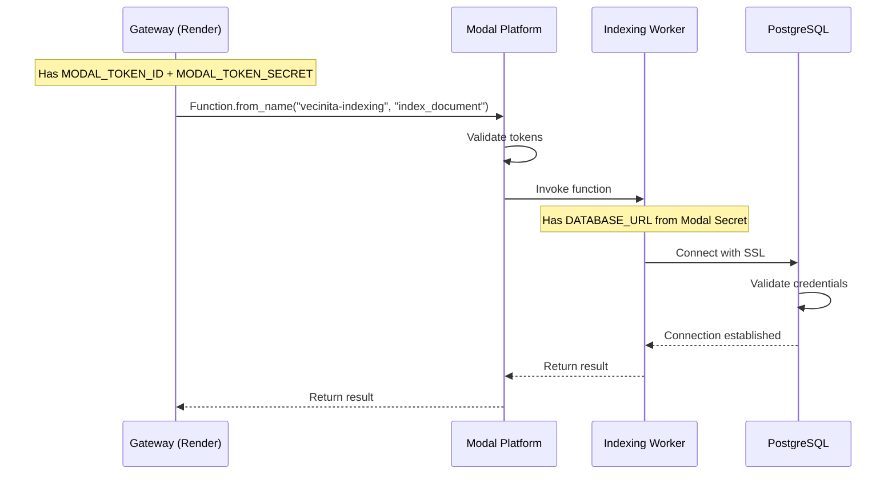

# Integration Points Diagram: Indexing Worker
> Auto-generated: 2026-05-12

## Service Connectivity Graph

```mermaid
graph TB
    subgraph "Render Platform"
        GW[vecinita-gateway<br/>Web Service<br/>Port 10000]
        PG[(PostgreSQL<br/>Render Managed<br/>pgvector enabled)]
    end

    subgraph "Modal Platform"
        subgraph "vecinita-indexing (planned)"
            IDX[index_document<br/>GPU: T4]
            BATCH[index_batch]
            REINDEX[reindex_changed]
            REBUILD[rebuild_all]
            HEALTH[health_check]
        end

        SCR[vecinita-scraper<br/>scraper_worker]
        EMB[vecinita-embedding<br/>embed_query]
        VOL[(vecinita-embedding-models<br/>Shared Volume)]
    end

    GW -->|"Modal SDK .remote()"| IDX
    GW -->|"Modal SDK .remote()"| BATCH
    GW -->|"Modal SDK .remote()"| REINDEX
    GW -->|"Modal SDK .spawn()"| REBUILD
    GW -->|"Modal SDK .remote()"| HEALTH

    SCR -->|"Modal SDK .remote()<br/>(after scrape completes)"| IDX

    IDX -->|"TCP/SSL<br/>SELECT data_mgmt.documents"| PG
    IDX -->|"TCP/SSL<br/>INSERT agent.vectors"| PG
    REINDEX -->|"TCP/SSL<br/>SELECT agent.content_hashes"| PG
    REBUILD -->|"TCP/SSL<br/>DELETE + INSERT"| PG

    IDX -.->|"mount /models"| VOL
    EMB -.->|"mount /models"| VOL
```

## Protocol Detail

```mermaid
graph LR
    subgraph "Inbound (Modal SDK)"
        GW_IN["Gateway<br/>Function.from_name()<br/>.remote() / .spawn()"]
        SCR_IN["Scraper Worker<br/>Function.from_name()<br/>.remote()"]
    end

    subgraph "Indexing Worker"
        FNS["Modal Functions<br/>(5 functions)"]
    end

    subgraph "Outbound"
        PG_OUT["PostgreSQL<br/>psycopg2<br/>TCP:5432 + SSL"]
        VOL_OUT["Model Volume<br/>File I/O<br/>mount at /models"]
    end

    GW_IN -->|"gRPC (Modal SDK)"| FNS
    SCR_IN -->|"gRPC (Modal SDK)"| FNS
    FNS -->|"SQL queries"| PG_OUT
    FNS -->|"Read model files"| VOL_OUT
```

## Authentication Flow

```mermaid
sequenceDiagram
    participant GW as Gateway (Render)
    participant Modal as Modal Platform
    participant IW as Indexing Worker
    participant PG as PostgreSQL

    Note over GW: Has MODAL_TOKEN_ID + MODAL_TOKEN_SECRET
    GW->>Modal: Function.from_name("vecinita-indexing", "index_document")
    Modal->>Modal: Validate tokens
    Modal->>IW: Invoke function
    Note over IW: Has DATABASE_URL from Modal Secret
    IW->>PG: Connect with SSL
    PG->>PG: Validate credentials
    PG-->>IW: Connection established
    IW-->>Modal: Return result
    Modal-->>GW: Return result
```
