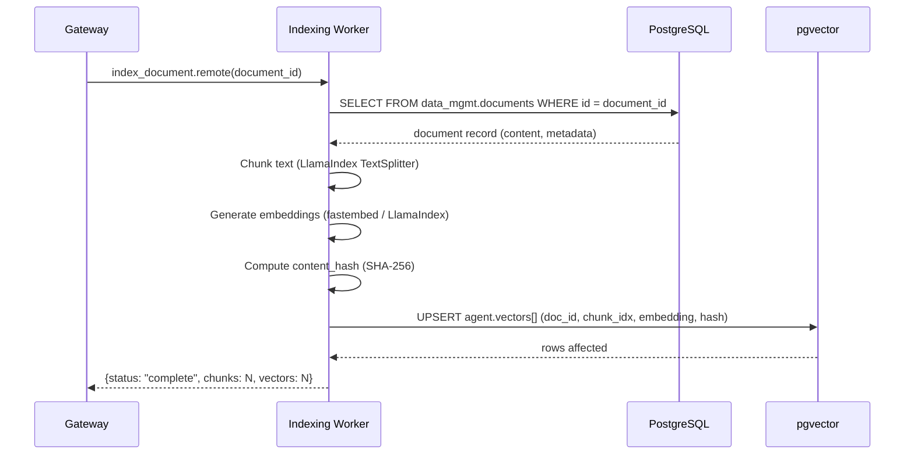
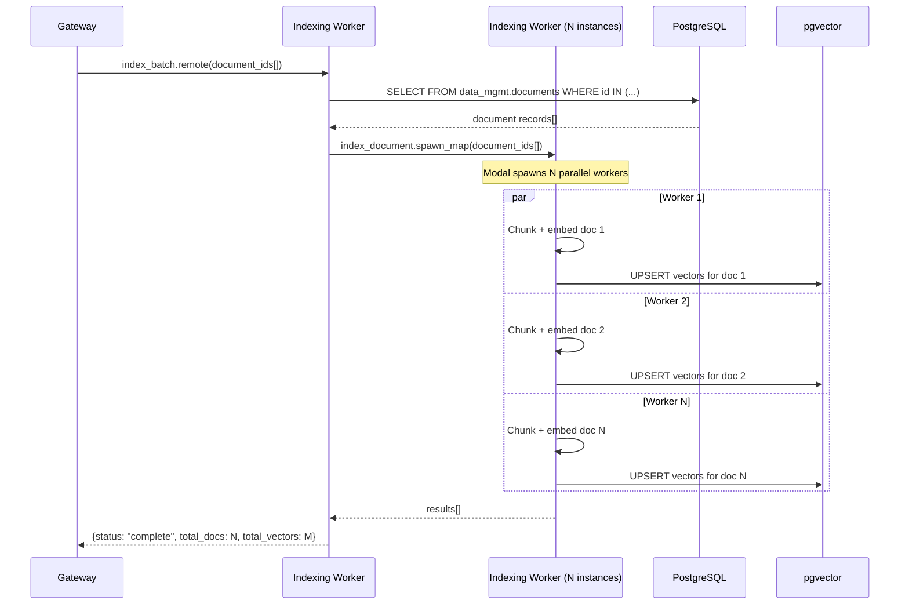
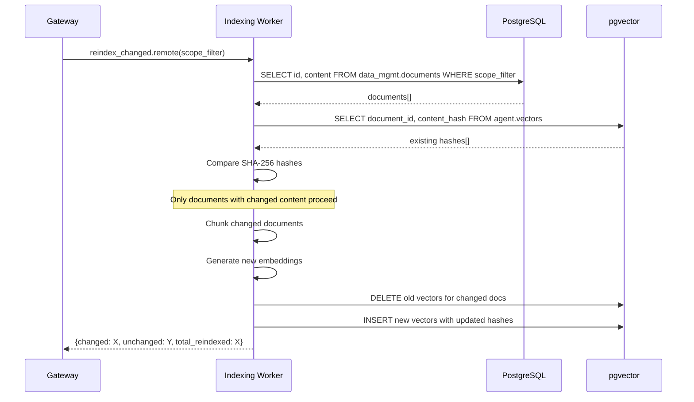
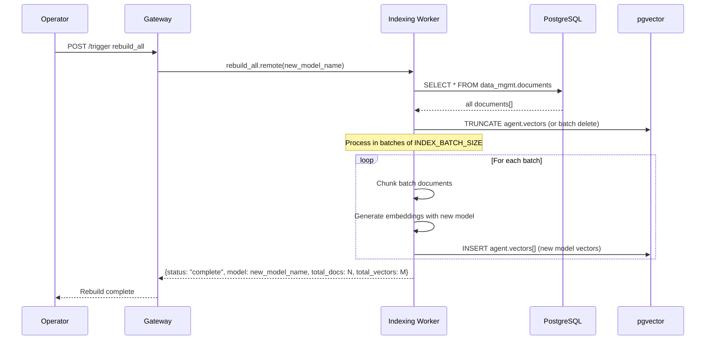
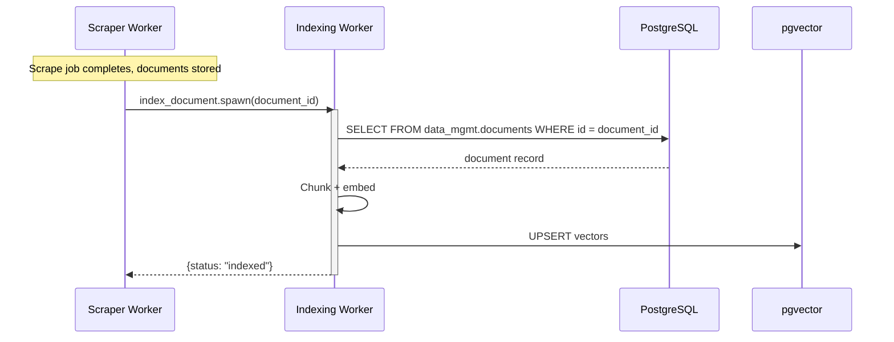
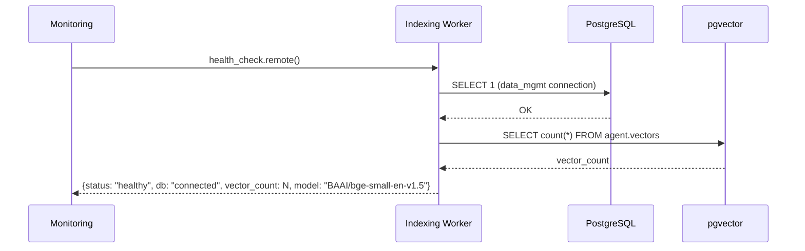

# Indexing Worker — Sequence Flow Diagrams
> Auto-generated: 2026-05-12

## Single Document Indexing

## Batch Indexing via spawn_map

## Selective Re-Indexing (Changed Content)

## Full Rebuild (Model Change)

## Scraper-Triggered Indexing (Post-Scrape)

## Health Check

