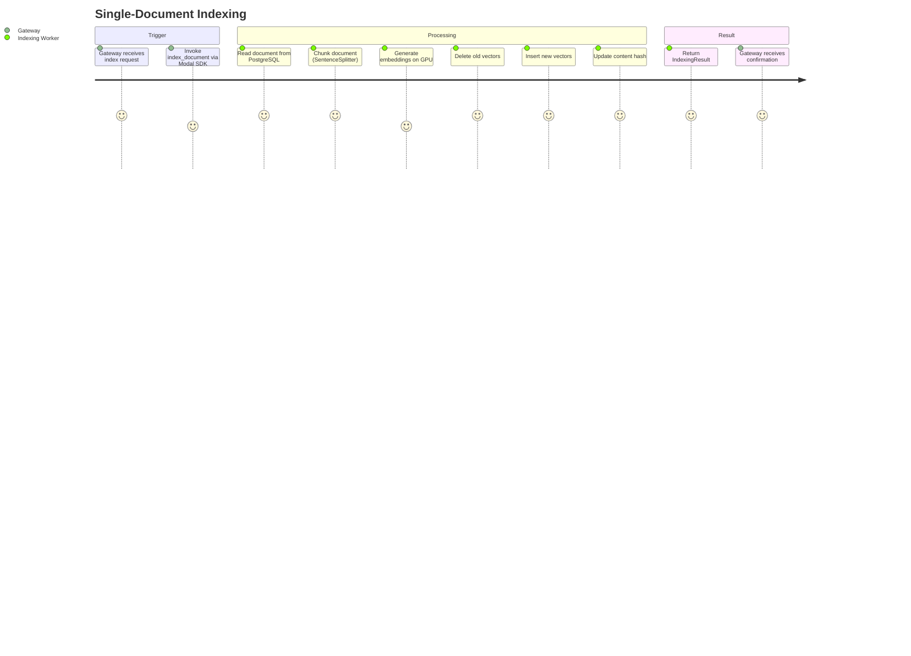
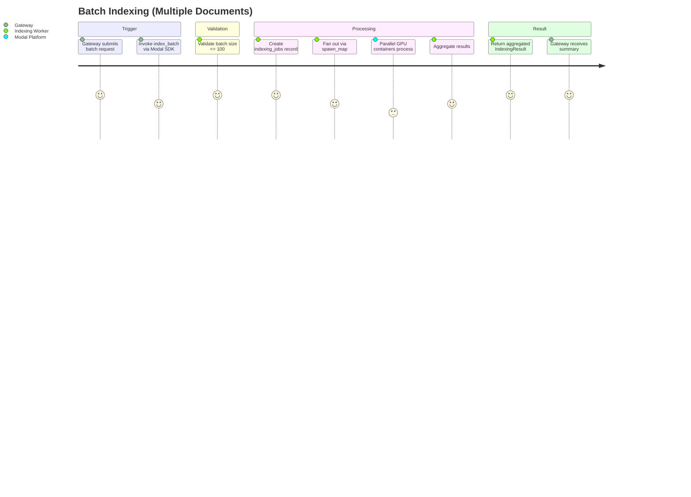
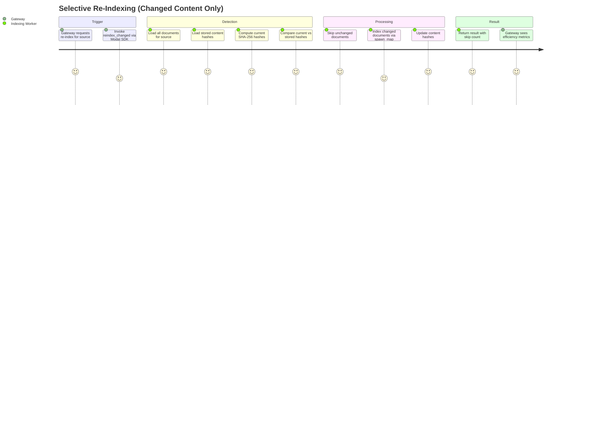
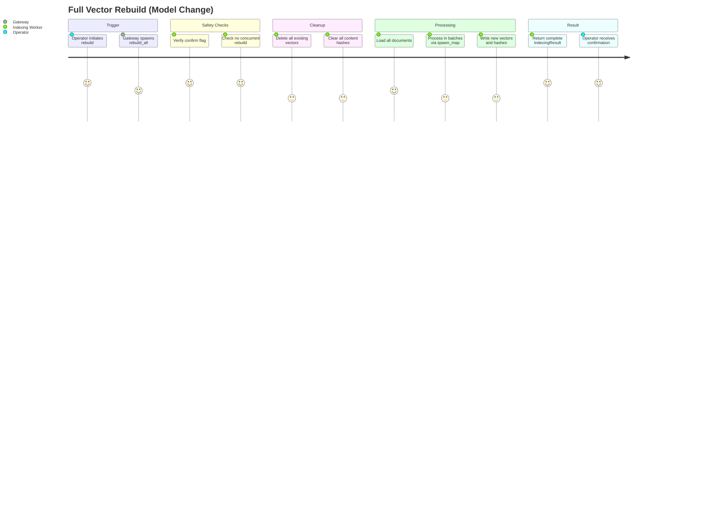
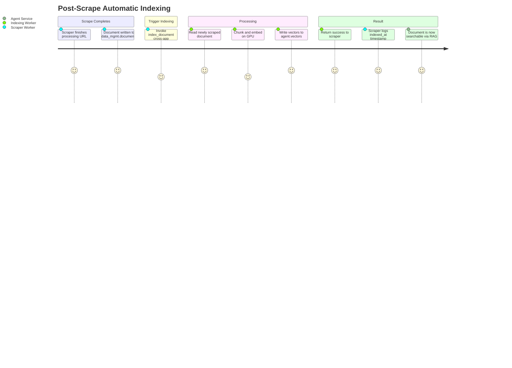

# User Journeys Diagram: Indexing Worker
> Auto-generated: 2026-05-12

## Journey 1: Single-Document Indexing

## Journey 2: Batch Indexing

## Journey 3: Selective Re-Indexing

## Journey 4: Full Vector Rebuild

## Journey 5: Post-Scrape Auto-Indexing

