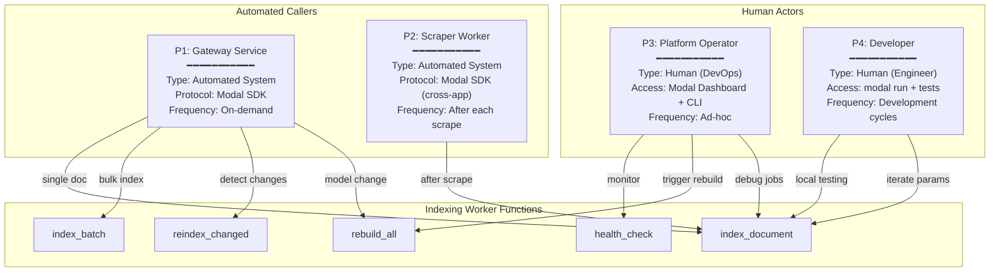
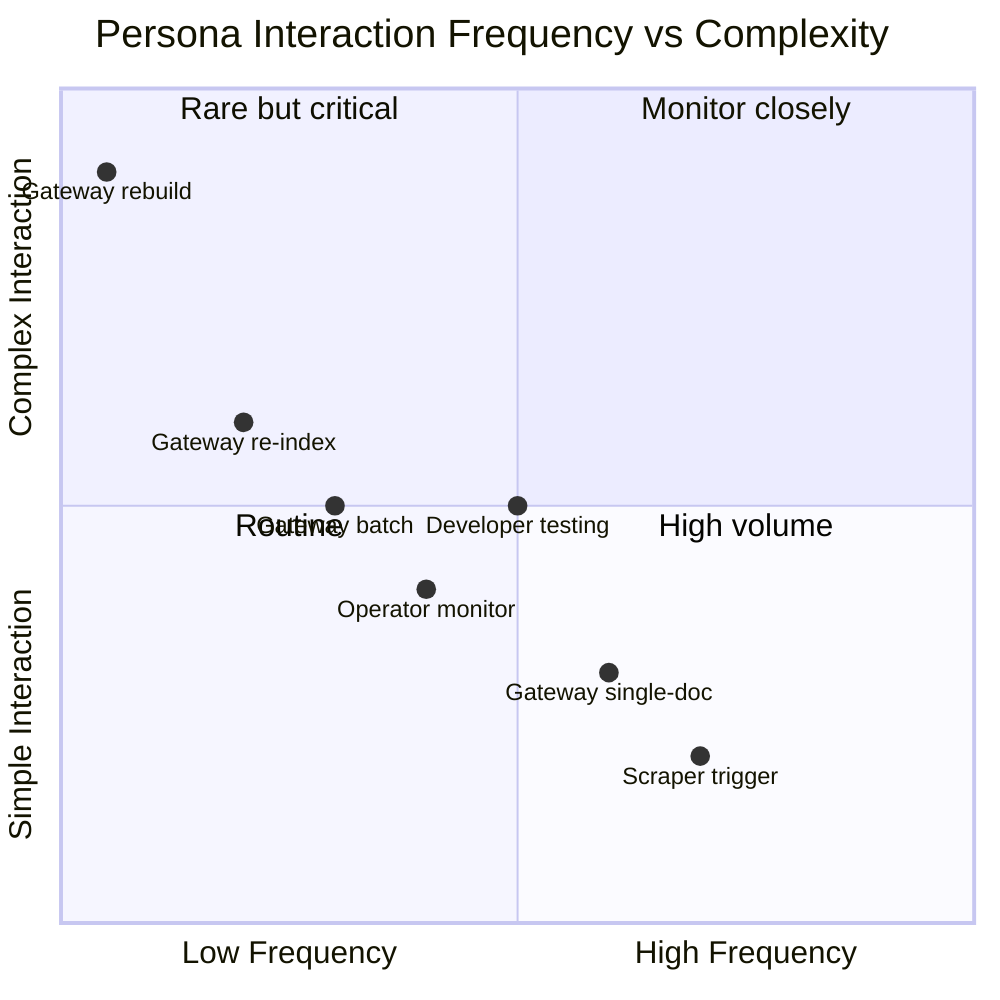

# User Personas Diagram: Indexing Worker
> Auto-generated: 2026-05-12

## Actor Relationship Diagram

```mermaid
graph TB
    subgraph "Automated Callers"
        GW["P1: Gateway Service<br/>━━━━━━━━━━━<br/>Type: Automated System<br/>Protocol: Modal SDK<br/>Frequency: On-demand"]
        SCR["P2: Scraper Worker<br/>━━━━━━━━━━━<br/>Type: Automated System<br/>Protocol: Modal SDK (cross-app)<br/>Frequency: After each scrape"]
    end

    subgraph "Human Actors"
        OPS["P3: Platform Operator<br/>━━━━━━━━━━━<br/>Type: Human (DevOps)<br/>Access: Modal Dashboard + CLI<br/>Frequency: Ad-hoc"]
        DEV["P4: Developer<br/>━━━━━━━━━━━<br/>Type: Human (Engineer)<br/>Access: modal run + tests<br/>Frequency: Development cycles"]
    end

    subgraph "Indexing Worker Functions"
        IDX[index_document]
        BATCH[index_batch]
        REINDEX[reindex_changed]
        REBUILD[rebuild_all]
        HEALTH[health_check]
    end

    GW -->|"single doc"| IDX
    GW -->|"bulk index"| BATCH
    GW -->|"detect changes"| REINDEX
    GW -->|"model change"| REBUILD

    SCR -->|"after scrape"| IDX

    OPS -->|"monitor"| HEALTH
    OPS -->|"trigger rebuild"| REBUILD
    OPS -->|"debug jobs"| IDX

    DEV -->|"local testing"| IDX
    DEV -->|"iterate params"| IDX
```

## Interaction Frequency Matrix

```mermaid
quadrantChart
    title Persona Interaction Frequency vs Complexity
    x-axis Low Frequency --> High Frequency
    y-axis Simple Interaction --> Complex Interaction
    quadrant-1 "Monitor closely"
    quadrant-2 "Rare but critical"
    quadrant-3 "Routine"
    quadrant-4 "High volume"
    "Gateway single-doc": [0.6, 0.3]
    "Gateway batch": [0.3, 0.5]
    "Gateway re-index": [0.2, 0.6]
    "Gateway rebuild": [0.05, 0.9]
    "Scraper trigger": [0.7, 0.2]
    "Operator monitor": [0.4, 0.4]
    "Developer testing": [0.5, 0.5]
```
