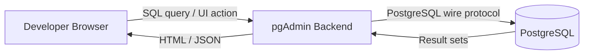
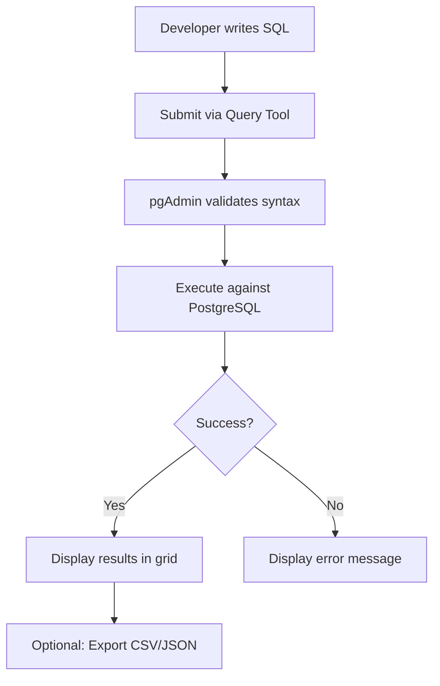

# pgadmin — Data Flow Diagram

> Auto-generated: 2026-05-12

## Primary Data Flow

```mermaid
flowchart LR
    Dev[Developer Browser] -->|"SQL query / UI action"| PGA[pgAdmin Backend]
    PGA -->|"PostgreSQL wire protocol"| DB[(PostgreSQL)]
    DB -->|"Result sets"| PGA
    PGA -->|"HTML / JSON"| Dev
```

## Query Execution Flow

```mermaid
flowchart TD
    A[Developer writes SQL] --> B[Submit via Query Tool]
    B --> C[pgAdmin validates syntax]
    C --> D[Execute against PostgreSQL]
    D --> E{Success?}
    E -->|Yes| F[Display results in grid]
    E -->|No| G[Display error message]
    F --> H[Optional: Export CSV/JSON]
```
