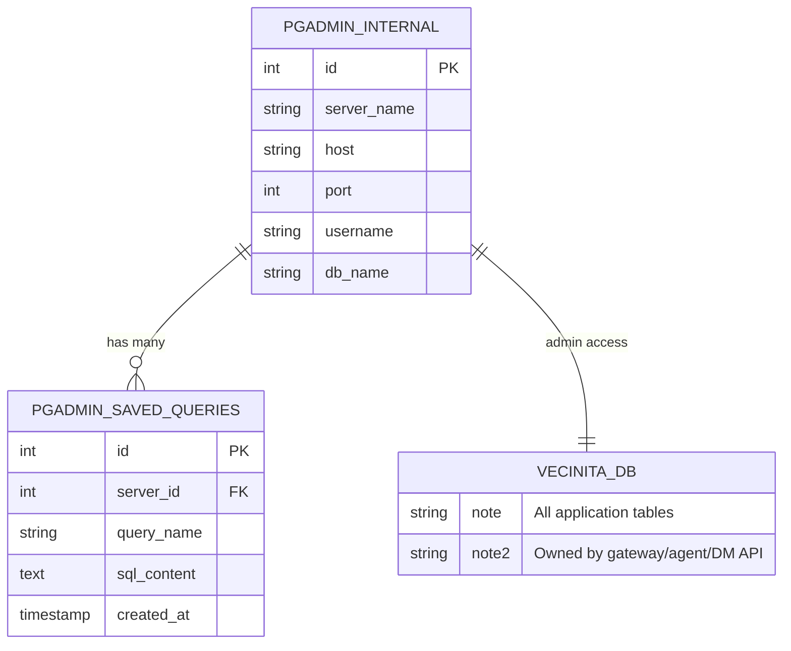

# pgadmin — Data Model Diagram

> Auto-generated: 2026-05-12

pgAdmin does not own any application data models. It accesses all Vecinita database tables as an admin tool. Its own internal state is managed in a SQLite database.

