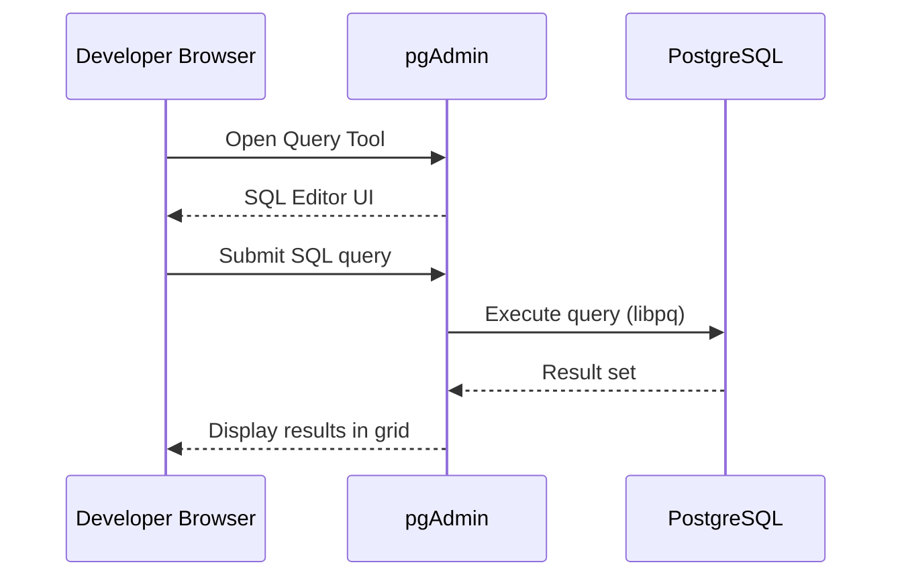
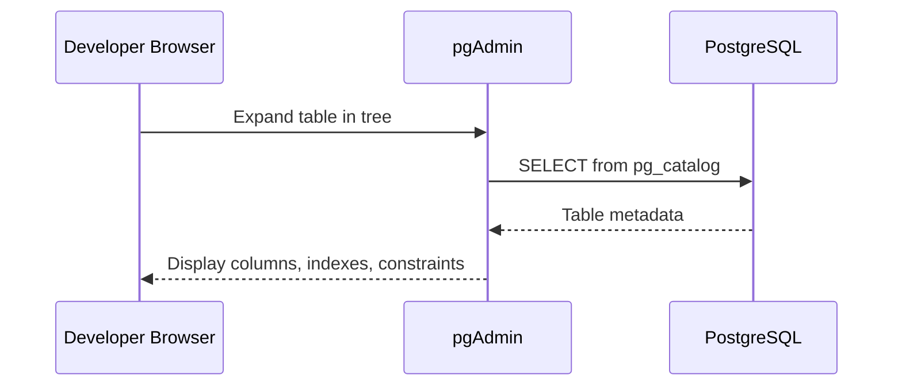
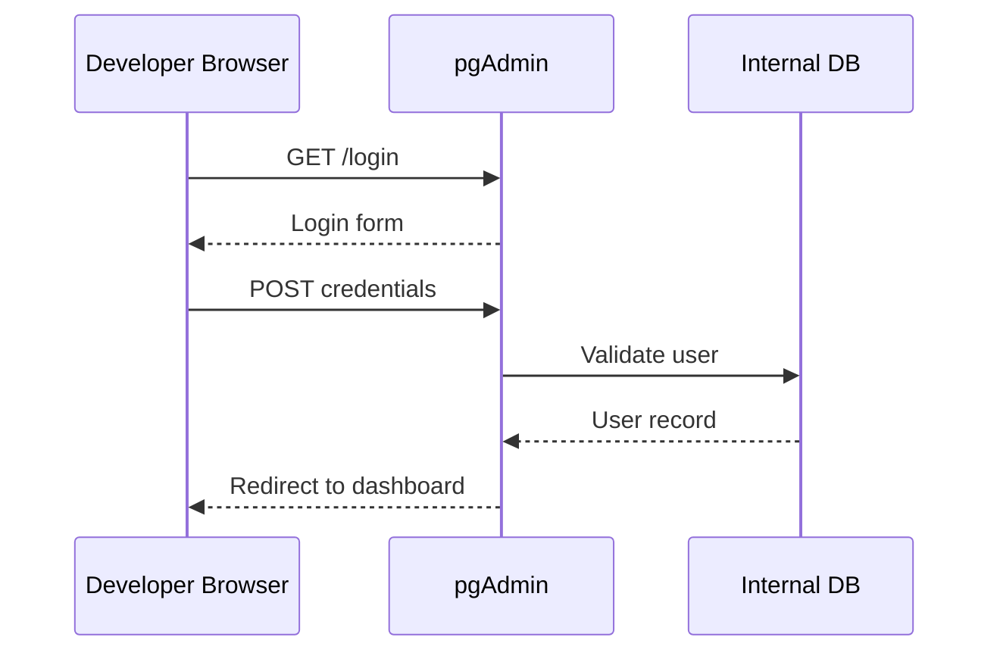

# pgadmin — Sequence Flow Diagrams

> Auto-generated: 2026-05-12

## Query Execution Flow

```mermaid
sequenceDiagram
    participant Dev as Developer Browser
    participant PGA as pgAdmin
    participant DB as PostgreSQL

    Dev->>PGA: Open Query Tool
    PGA-->>Dev: SQL Editor UI
    Dev->>PGA: Submit SQL query
    PGA->>DB: Execute query (libpq)
    DB-->>PGA: Result set
    PGA-->>Dev: Display results in grid
```

## Schema Browse Flow

```mermaid
sequenceDiagram
    participant Dev as Developer Browser
    participant PGA as pgAdmin
    participant DB as PostgreSQL

    Dev->>PGA: Expand table in tree
    PGA->>DB: SELECT from pg_catalog
    DB-->>PGA: Table metadata
    PGA-->>Dev: Display columns, indexes, constraints
```

## Login Flow

```mermaid
sequenceDiagram
    participant Dev as Developer Browser
    participant PGA as pgAdmin
    participant SQLite as Internal DB

    Dev->>PGA: GET /login
    PGA-->>Dev: Login form
    Dev->>PGA: POST credentials
    PGA->>SQLite: Validate user
    SQLite-->>PGA: User record
    PGA-->>Dev: Redirect to dashboard
```
