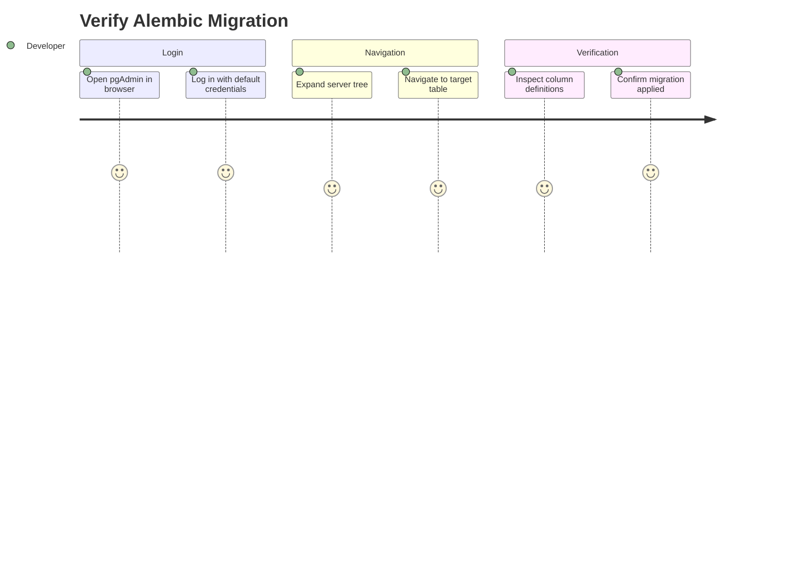
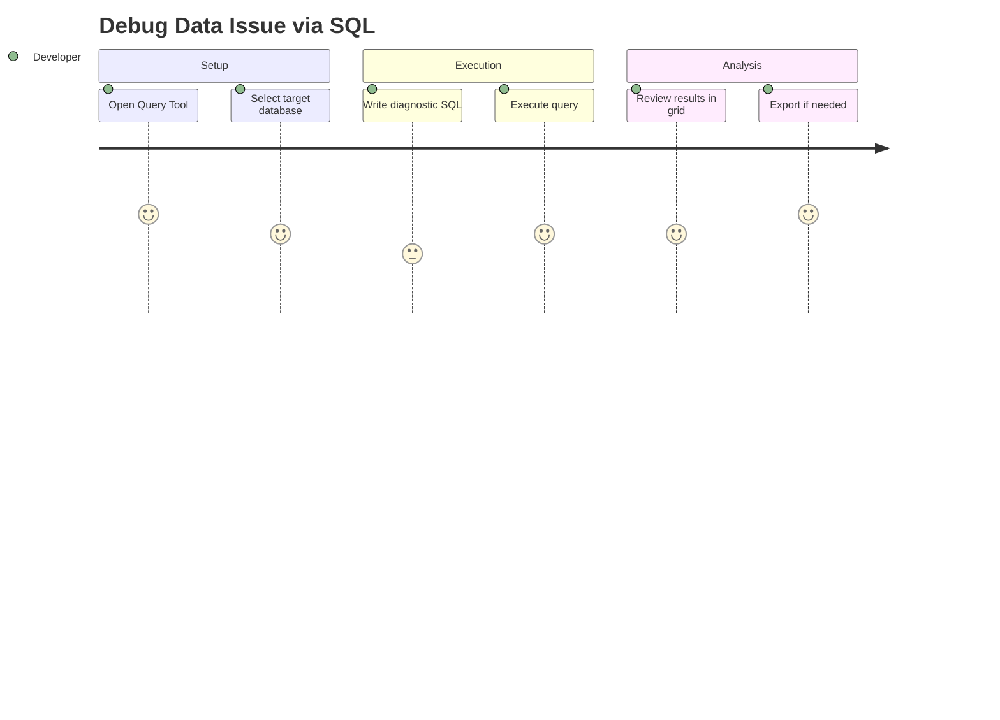

# pgadmin — User Journey Diagrams

> Auto-generated: 2026-05-12

## Inspect Database After Migration

```mermaid
journey
    title Verify Alembic Migration
    section Login
        Open pgAdmin in browser: 5: Developer
        Log in with default credentials: 5: Developer
    section Navigation
        Expand server tree: 4: Developer
        Navigate to target table: 4: Developer
    section Verification
        Inspect column definitions: 4: Developer
        Confirm migration applied: 5: Developer
```

## Run Diagnostic Query

```mermaid
journey
    title Debug Data Issue via SQL
    section Setup
        Open Query Tool: 5: Developer
        Select target database: 4: Developer
    section Execution
        Write diagnostic SQL: 3: Developer
        Execute query: 4: Developer
    section Analysis
        Review results in grid: 4: Developer
        Export if needed: 5: Developer
```
