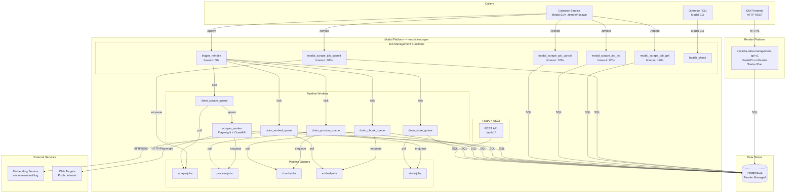
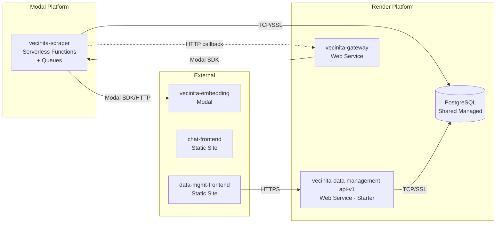

# Architecture Diagram: Scraper Worker
> Auto-generated: 2026-05-12

## Component Diagram

```mermaid
graph TB
    subgraph "Callers"
        GW[Gateway Service<br/>Modal SDK .remote/.spawn]
        DMF[DM Frontend<br/>HTTP REST]
        OP[Operator / CLI<br/>Modal CLI]
    end

    subgraph "Modal Platform — vecinita-scraper"
        subgraph "Job Management Functions"
            SUBMIT[modal_scrape_job_submit<br/>timeout: 300s]
            GET[modal_scrape_job_get<br/>timeout: 120s]
            LIST[modal_scrape_job_list<br/>timeout: 120s]
            CANCEL[modal_scrape_job_cancel<br/>timeout: 120s]
            REINDEX[trigger_reindex<br/>timeout: 60s]
            HEALTH[health_check]
        end

        subgraph "Pipeline Queues"
            Q1[scrape-jobs]
            Q2[process-jobs]
            Q3[chunk-jobs]
            Q4[embed-jobs]
            Q5[store-jobs]
        end

        subgraph "Pipeline Workers"
            W1[scraper_worker<br/>Playwright + Crawl4AI]
            D1[drain_scrape_queue]
            D2[drain_process_queue]
            D3[drain_chunk_queue]
            D4[drain_embed_queue]
            D5[drain_store_queue]
        end

        subgraph "FastAPI ASGI"
            API[REST API<br/>/api/v1/]
        end
    end

    subgraph "Render Platform"
        DMAPI[vecinita-data-management-api-v1<br/>FastAPI on Render<br/>Starter Plan]
    end

    subgraph "Data Stores"
        PG[(PostgreSQL<br/>Render Managed)]
    end

    subgraph "External Services"
        EMB[Embedding Service<br/>vecinita-embedding]
        WEB[Web Targets<br/>Public Internet]
    end

    GW -->|.remote| SUBMIT
    GW -->|.remote| GET
    GW -->|.remote| LIST
    GW -->|.remote| CANCEL
    GW -->|.spawn| REINDEX

    DMF -->|HTTPS| DMAPI
    OP -->|Modal CLI| HEALTH

    SUBMIT -->|enqueue| Q1
    REINDEX -->|kick| D1
    REINDEX -->|kick| D2
    REINDEX -->|kick| D3
    REINDEX -->|kick| D4
    REINDEX -->|kick| D5

    D1 -->|pull| Q1
    D1 -->|spawn| W1
    W1 -->|enqueue| Q2
    D2 -->|pull| Q2
    D2 -->|enqueue| Q3
    D3 -->|pull| Q3
    D3 -->|enqueue| Q4
    D4 -->|pull| Q4
    D4 -->|enqueue| Q5
    D5 -->|pull| Q5

    W1 -->|HTTP/Playwright| WEB
    D4 -->|HTTP/SDK| EMB

    SUBMIT -->|SQL| PG
    GET -->|SQL| PG
    LIST -->|SQL| PG
    CANCEL -->|SQL| PG
    W1 -->|SQL| PG
    D2 -->|SQL| PG
    D3 -->|SQL| PG
    D4 -->|SQL| PG
    D5 -->|SQL| PG

    DMAPI -->|SQL| PG
    API -->|SQL| PG
```

## Deployment Diagram

```mermaid
graph LR
    subgraph "Modal Platform"
        MS[vecinita-scraper<br/>Serverless Functions<br/>+ Queues]
    end

    subgraph "Render Platform"
        DMAPI[vecinita-data-management-api-v1<br/>Web Service - Starter]
        DB[(PostgreSQL<br/>Shared Managed)]
        GW[vecinita-gateway<br/>Web Service]
    end

    subgraph "External"
        EMB[vecinita-embedding<br/>Modal]
        CHAT[chat-frontend<br/>Static Site]
        DM[data-mgmt-frontend<br/>Static Site]
    end

    GW -->|Modal SDK| MS
    DM -->|HTTPS| DMAPI
    MS -->|TCP/SSL| DB
    DMAPI -->|TCP/SSL| DB
    MS -->|Modal SDK/HTTP| EMB
    MS -.->|HTTP callback| GW
```

## Pipeline Stage Diagram

```mermaid
graph LR
    SUBMIT[Job Submit] --> Q1[scrape-jobs<br/>queue]
    Q1 --> S1[Stage 1<br/>Scrape]
    S1 --> Q2[process-jobs<br/>queue]
    Q2 --> S2[Stage 2<br/>Process]
    S2 --> Q3[chunk-jobs<br/>queue]
    Q3 --> S3[Stage 3<br/>Chunk]
    S3 --> Q4[embed-jobs<br/>queue]
    Q4 --> S4[Stage 4<br/>Embed]
    S4 --> Q5[store-jobs<br/>queue]
    Q5 --> S5[Stage 5<br/>Store]
    S5 --> DONE[Job Complete]

    style SUBMIT fill:#e1f5fe
    style DONE fill:#e8f5e9
    style Q1 fill:#fff3e0
    style Q2 fill:#fff3e0
    style Q3 fill:#fff3e0
    style Q4 fill:#fff3e0
    style Q5 fill:#fff3e0
```
