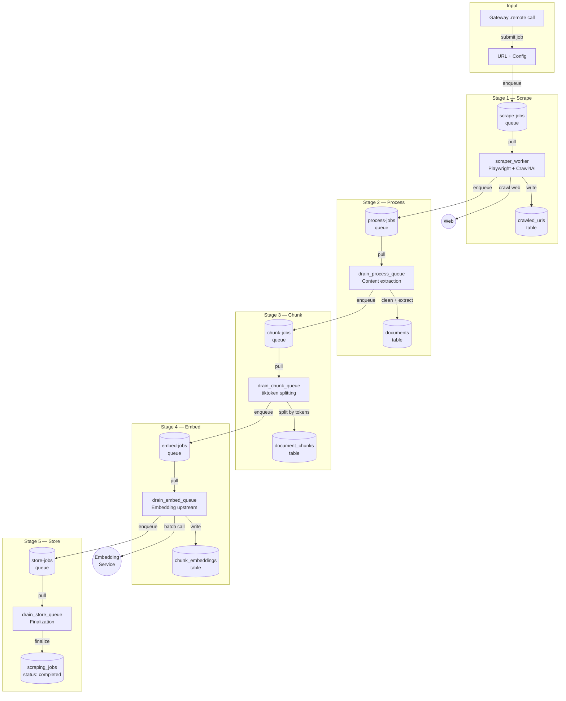
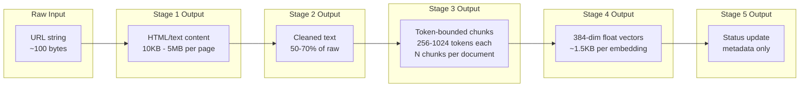
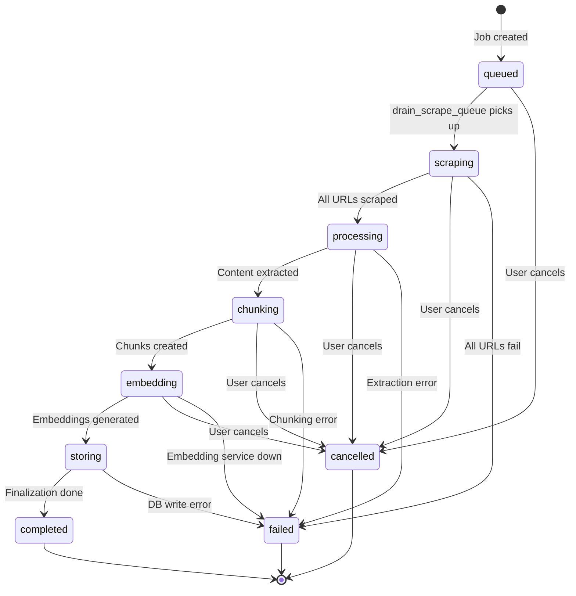
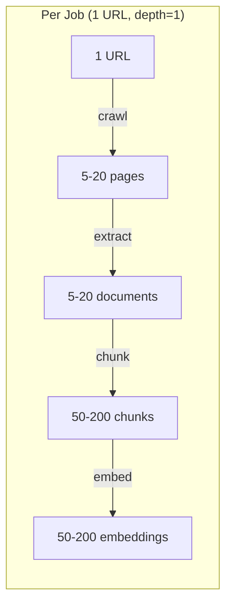

# Data Flow Diagram: Scraper Worker
> Auto-generated: 2026-05-12

## 5-Stage Pipeline Flow

## Data Transformation Detail

## Job Status State Machine

## Data Volume Estimates

| Metric | Per Page | Per Job (avg) |
|--------|----------|--------------|
| Raw HTML | 50-500 KB | 500 KB - 5 MB |
| Extracted text | 5-50 KB | 50 KB - 500 KB |
| Chunks | 5-20 | 50-200 |
| Embeddings | 5-20 | 50-200 |
| DB storage | ~10 KB | ~100 KB - 1 MB |
