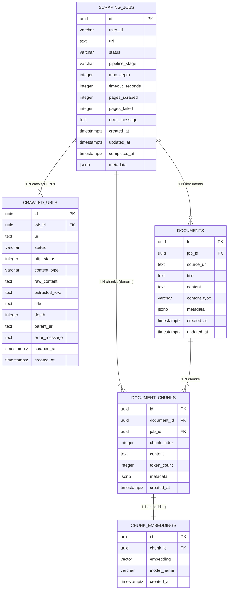
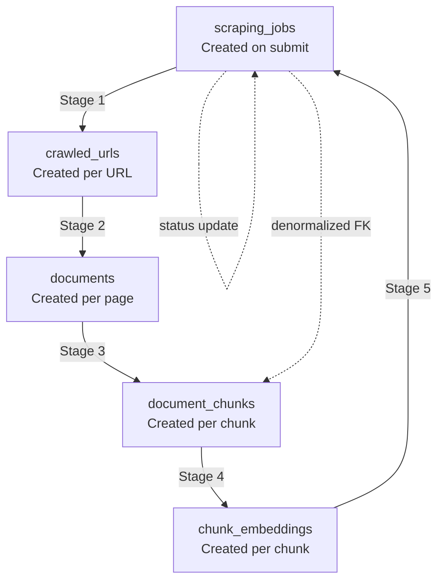
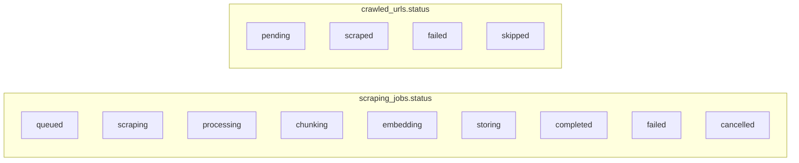

# Data Models Diagram: Scraper Worker
> Auto-generated: 2026-05-12

## Entity-Relationship Diagram

```mermaid
erDiagram
    SCRAPING_JOBS {
        uuid id PK
        varchar user_id
        text url
        varchar status
        varchar pipeline_stage
        integer max_depth
        integer timeout_seconds
        integer pages_scraped
        integer pages_failed
        text error_message
        timestamptz created_at
        timestamptz updated_at
        timestamptz completed_at
        jsonb metadata
    }

    CRAWLED_URLS {
        uuid id PK
        uuid job_id FK
        text url
        varchar status
        integer http_status
        varchar content_type
        text raw_content
        text extracted_text
        text title
        integer depth
        text parent_url
        text error_message
        timestamptz scraped_at
        timestamptz created_at
    }

    DOCUMENTS {
        uuid id PK
        uuid job_id FK
        text source_url
        text title
        text content
        varchar content_type
        jsonb metadata
        timestamptz created_at
        timestamptz updated_at
    }

    DOCUMENT_CHUNKS {
        uuid id PK
        uuid document_id FK
        uuid job_id FK
        integer chunk_index
        text content
        integer token_count
        jsonb metadata
        timestamptz created_at
    }

    CHUNK_EMBEDDINGS {
        uuid id PK
        uuid chunk_id FK
        vector embedding
        varchar model_name
        timestamptz created_at
    }

    SCRAPING_JOBS ||--o{ CRAWLED_URLS : "1:N crawled URLs"
    SCRAPING_JOBS ||--o{ DOCUMENTS : "1:N documents"
    SCRAPING_JOBS ||--o{ DOCUMENT_CHUNKS : "1:N chunks (denorm)"
    DOCUMENTS ||--o{ DOCUMENT_CHUNKS : "1:N chunks"
    DOCUMENT_CHUNKS ||--|| CHUNK_EMBEDDINGS : "1:1 embedding"
```

## Pipeline Data Flow Through Models

```mermaid
flowchart TD
    SJ[scraping_jobs<br/>Created on submit]
    CU[crawled_urls<br/>Created per URL]
    DOC[documents<br/>Created per page]
    DC[document_chunks<br/>Created per chunk]
    CE[chunk_embeddings<br/>Created per chunk]

    SJ -->|Stage 1| CU
    CU -->|Stage 2| DOC
    DOC -->|Stage 3| DC
    DC -->|Stage 4| CE
    CE -->|Stage 5| SJ

    SJ -.->|denormalized FK| DC
    SJ -.->|status update| SJ
```

## Status Values

```mermaid
graph LR
    subgraph "scraping_jobs.status"
        S1[queued]
        S2[scraping]
        S3[processing]
        S4[chunking]
        S5[embedding]
        S6[storing]
        S7[completed]
        S8[failed]
        S9[cancelled]
    end

    subgraph "crawled_urls.status"
        C1[pending]
        C2[scraped]
        C3[failed]
        C4[skipped]
    end
```
