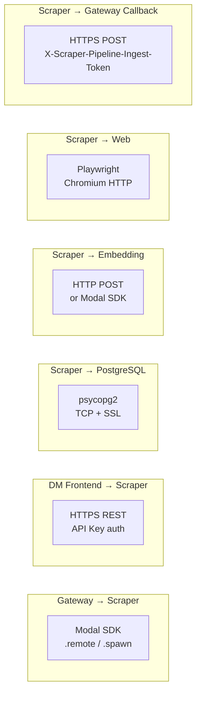

# Integration Points Diagram: Scraper Worker
> Auto-generated: 2026-05-12

## Service Connectivity Graph

```mermaid
graph TB
    subgraph "Inbound Callers"
        GW[Gateway Service<br/>Modal SDK]
        DMF[DM Frontend<br/>HTTP REST]
        OP[Operator<br/>Modal CLI / Dashboard]
    end

    subgraph "Scraper Worker"
        subgraph "Modal Functions"
            SUBMIT[modal_scrape_job_submit]
            GET_JOB[modal_scrape_job_get]
            LIST_JOB[modal_scrape_job_list]
            CANCEL[modal_scrape_job_cancel]
            REINDEX[trigger_reindex]
        end

        subgraph "Pipeline Workers"
            SCRAPE[scraper_worker]
            DRAIN[drain_*_queue x5]
        end

        subgraph "REST API"
            REST[FastAPI ASGI<br/>/api/v1/]
        end
    end

    subgraph "Outbound Dependencies"
        PG[(PostgreSQL<br/>Render Managed)]
        EMB[Embedding Service<br/>vecinita-embedding]
        WEB[Web Targets<br/>Public Internet]
        SUPA[Supabase<br/>Conditional]
    end

    GW -->|.remote()| SUBMIT
    GW -->|.remote()| GET_JOB
    GW -->|.remote()| LIST_JOB
    GW -->|.remote()| CANCEL
    GW -->|.spawn()| REINDEX

    DMF -->|HTTPS| REST
    OP -->|CLI| SUBMIT

    SUBMIT -->|psycopg2| PG
    GET_JOB -->|psycopg2| PG
    LIST_JOB -->|psycopg2| PG
    CANCEL -->|psycopg2| PG

    SCRAPE -->|Playwright| WEB
    DRAIN -->|psycopg2| PG
    DRAIN -->|HTTP/SDK| EMB
    REST -->|psycopg2| PG

    DRAIN -.->|conditional| SUPA
```

## Protocol Map



## Error Flow

```mermaid
flowchart TD
    GW[Gateway] -->|.remote()| FN[Modal Function]

    FN -->|Success| OK[Result returned]
    FN -->|TimeoutError| T1[504 Gateway Timeout]
    FN -->|FunctionTimeoutError| T2[504 Function Timeout]
    FN -->|RemoteError| T3[502 Bad Gateway]
    FN -->|Connection Failure| T4[503 Unavailable]

    SCRAPE[scraper_worker] -->|URL Fetch| WEB[Web Target]
    WEB -->|DNS Failure| F1[URL marked failed]
    WEB -->|HTTP 4xx| F2[URL marked failed]
    WEB -->|HTTP 5xx| F3[Retry once → failed]
    WEB -->|Timeout| F4[URL marked failed]
```
