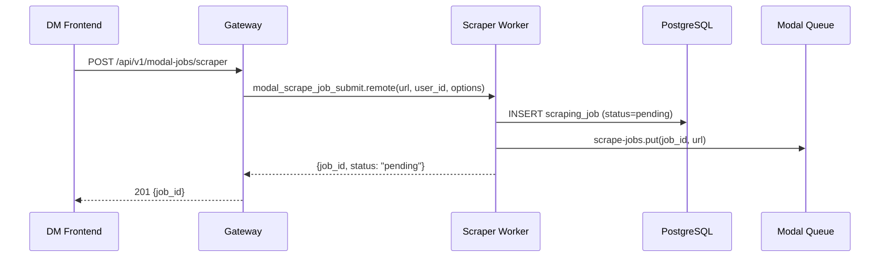
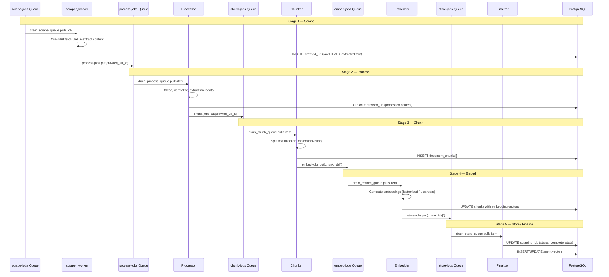
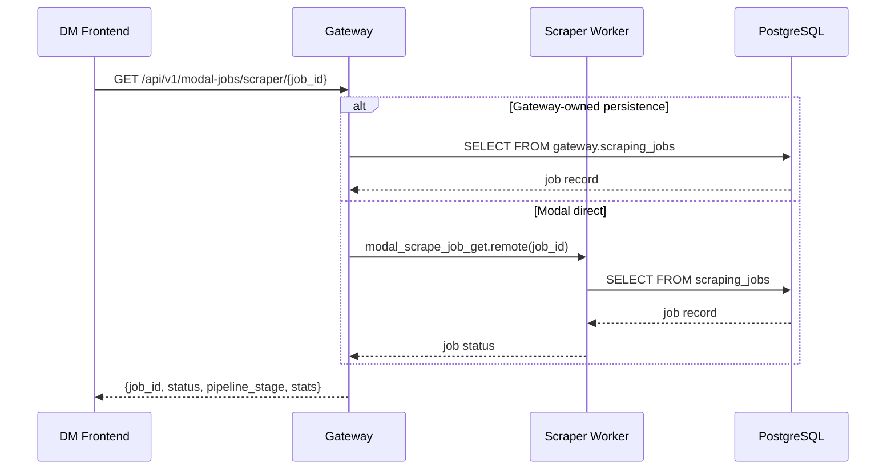
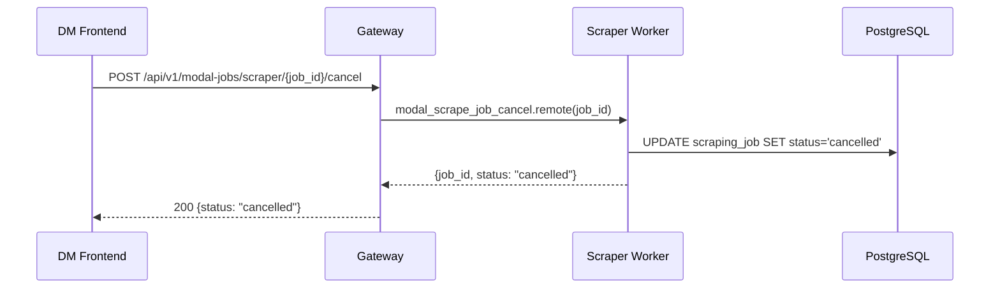
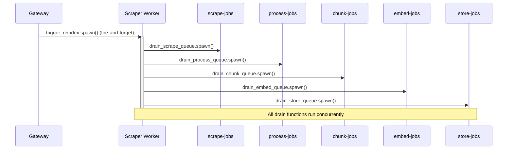
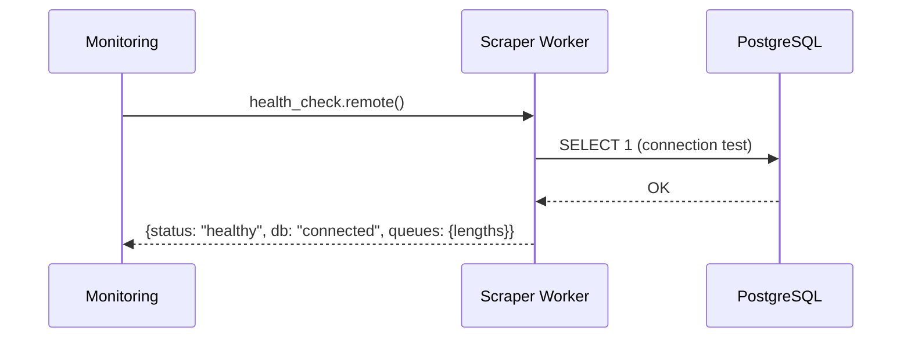

# Scraper Worker — Sequence Flow Diagrams
> Auto-generated: 2026-05-12

## Job Submission Flow

## Five-Stage Pipeline Execution

## Job Status Query

## Job Cancellation

## Reindex Trigger (Fire-and-Forget)

## Health Check

