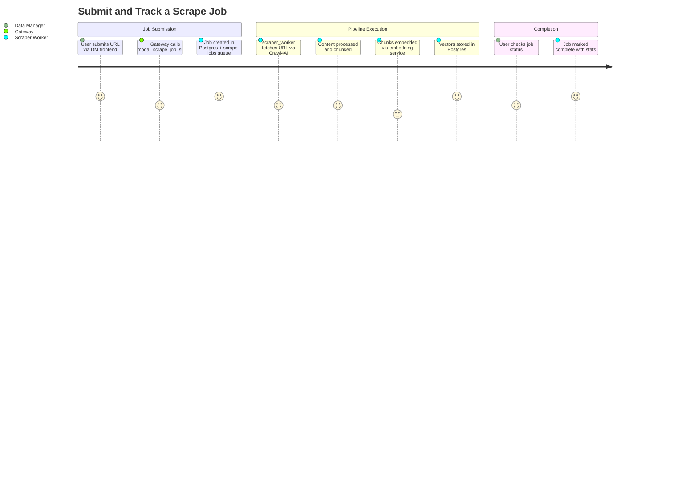
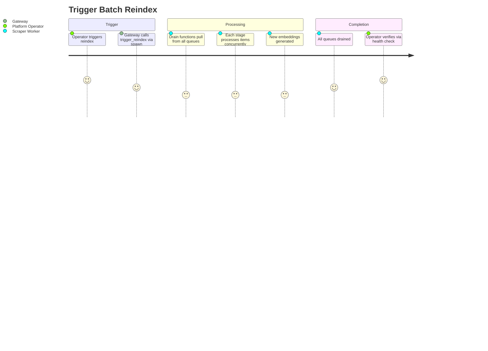
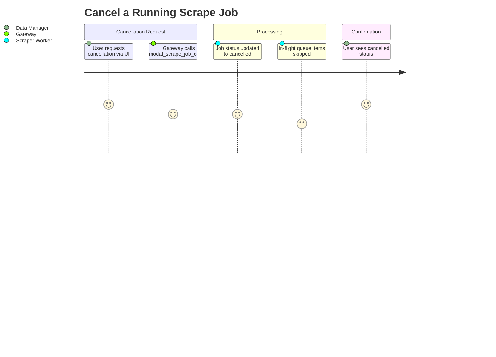
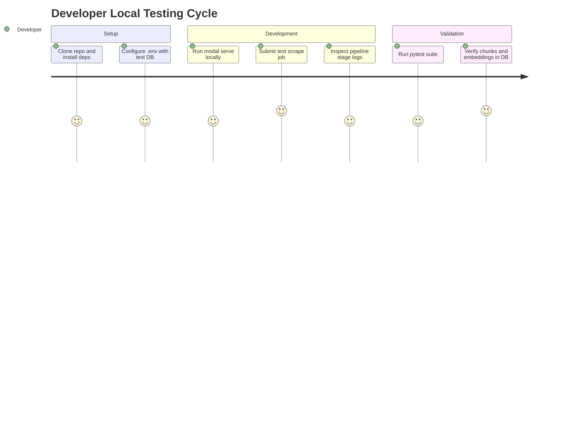

# Scraper Worker — User Journey Diagrams
> Auto-generated: 2026-05-12

## Submit and Track Scrape Job

```mermaid
journey
    title Submit and Track a Scrape Job
    section Job Submission
        User submits URL via DM frontend: 5: Data Manager
        Gateway calls modal_scrape_job_submit: 4: Gateway
        Job created in Postgres + scrape-jobs queue: 5: Scraper Worker
    section Pipeline Execution
        scraper_worker fetches URL via Crawl4AI: 4: Scraper Worker
        Content processed and chunked: 4: Scraper Worker
        Chunks embedded via embedding service: 3: Scraper Worker
        Vectors stored in Postgres: 5: Scraper Worker
    section Completion
        User checks job status: 4: Data Manager
        Job marked complete with stats: 5: Scraper Worker
```

## Batch Reindex Flow

```mermaid
journey
    title Trigger Batch Reindex
    section Trigger
        Operator triggers reindex: 5: Platform Operator
        Gateway calls trigger_reindex via spawn: 4: Gateway
    section Processing
        Drain functions pull from all queues: 3: Scraper Worker
        Each stage processes items concurrently: 3: Scraper Worker
        New embeddings generated: 3: Scraper Worker
    section Completion
        All queues drained: 4: Scraper Worker
        Operator verifies via health check: 5: Platform Operator
```

## Job Cancellation

```mermaid
journey
    title Cancel a Running Scrape Job
    section Cancellation Request
        User requests cancellation via UI: 5: Data Manager
        Gateway calls modal_scrape_job_cancel: 4: Gateway
    section Processing
        Job status updated to cancelled: 4: Scraper Worker
        In-flight queue items skipped: 3: Scraper Worker
    section Confirmation
        User sees cancelled status: 5: Data Manager
```

## Developer Local Testing

```mermaid
journey
    title Developer Local Testing Cycle
    section Setup
        Clone repo and install deps: 4: Developer
        Configure .env with test DB: 4: Developer
    section Development
        Run modal serve locally: 4: Developer
        Submit test scrape job: 5: Developer
        Inspect pipeline stage logs: 4: Developer
    section Validation
        Run pytest suite: 4: Developer
        Verify chunks and embeddings in DB: 5: Developer
```
