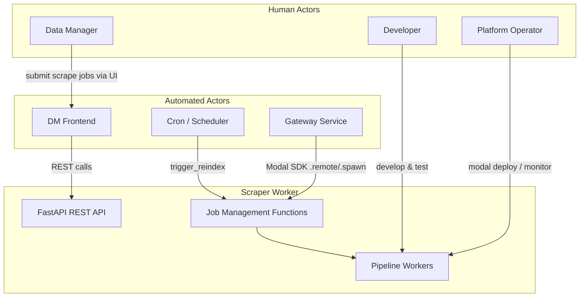
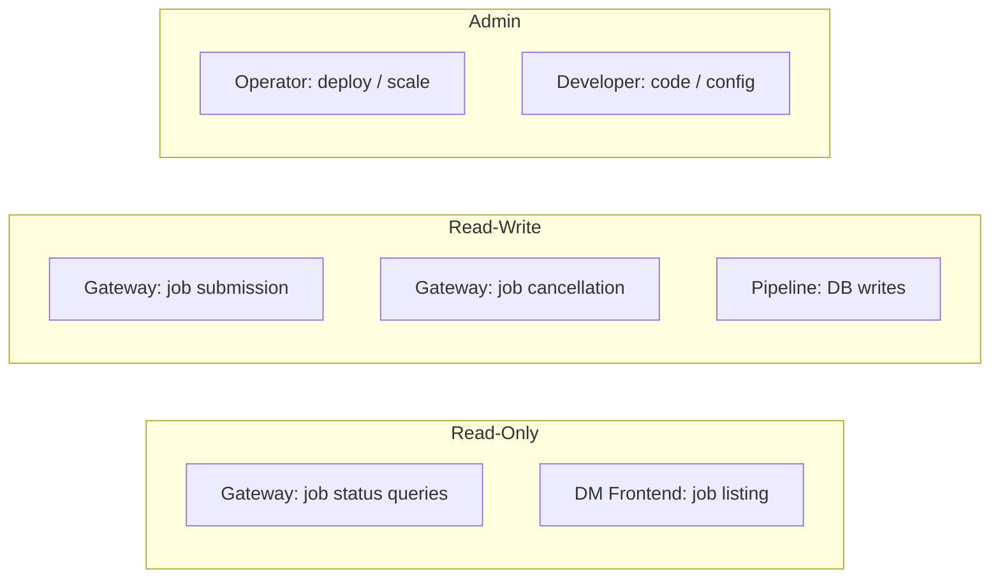

# Scraper Worker — User Personas Diagram
> Auto-generated: 2026-05-12

## Actor Relationship Map

```mermaid
graph TB
    subgraph Human Actors
        DevOps[Platform Operator]
        Dev[Developer]
        DataMgr[Data Manager]
    end

    subgraph Automated Actors
        GW[Gateway Service]
        DMFE[DM Frontend]
        Scheduler[Cron / Scheduler]
    end

    subgraph Scraper Worker
        API[FastAPI REST API]
        JobMgmt[Job Management Functions]
        Pipeline[Pipeline Workers]
    end

    DataMgr -->|submit scrape jobs via UI| DMFE
    DMFE -->|REST calls| API
    GW -->|Modal SDK .remote/.spawn| JobMgmt
    Scheduler -->|trigger_reindex| JobMgmt
    DevOps -->|modal deploy / monitor| Pipeline
    Dev -->|develop & test| Pipeline
    JobMgmt --> Pipeline
```

## Access Matrix

```mermaid
graph LR
    subgraph Read-Only
        GW_GET[Gateway: job status queries]
        DM_LIST[DM Frontend: job listing]
    end

    subgraph Read-Write
        GW_SUB[Gateway: job submission]
        GW_CAN[Gateway: job cancellation]
        PIPE[Pipeline: DB writes]
    end

    subgraph Admin
        OPS[Operator: deploy / scale]
        DEV[Developer: code / config]
    end
```
