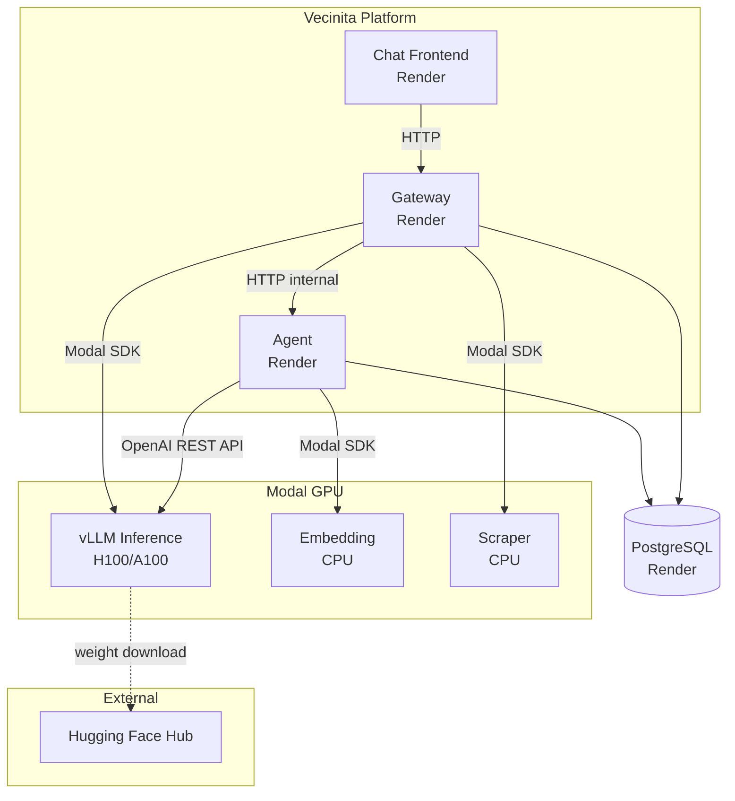
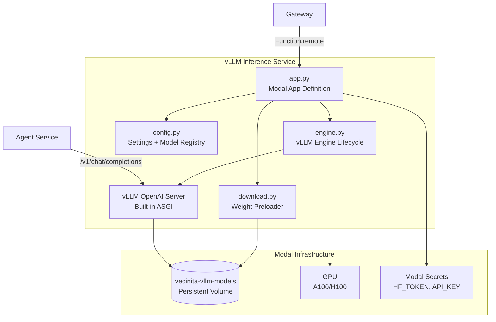

# vLLM Inference — Architecture Diagram
> Auto-generated: 2026-05-12

## System Context



## Component View



## Layer Diagram

```mermaid
graph TB
    subgraph API Layer
        OAI[OpenAI-Compatible API<br/>/v1/chat/completions<br/>/v1/completions<br/>/v1/models]
        HEALTH[/health]
    end

    subgraph Engine Layer
        SCHED[vLLM Scheduler<br/>Continuous Batching]
        PA[PagedAttention<br/>KV Cache Manager]
        TOK[Tokenizer<br/>HF Transformers]
    end

    subgraph Infrastructure Layer
        MODAL[Modal Container<br/>GPU + Volume]
        CUDA[CUDA Runtime<br/>12.1+]
    end

    OAI --> SCHED
    HEALTH --> SCHED
    SCHED --> PA
    SCHED --> TOK
    PA --> CUDA
    CUDA --> MODAL
```
