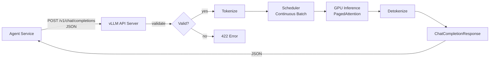
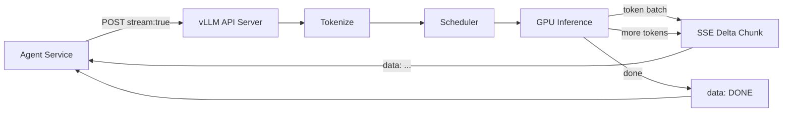
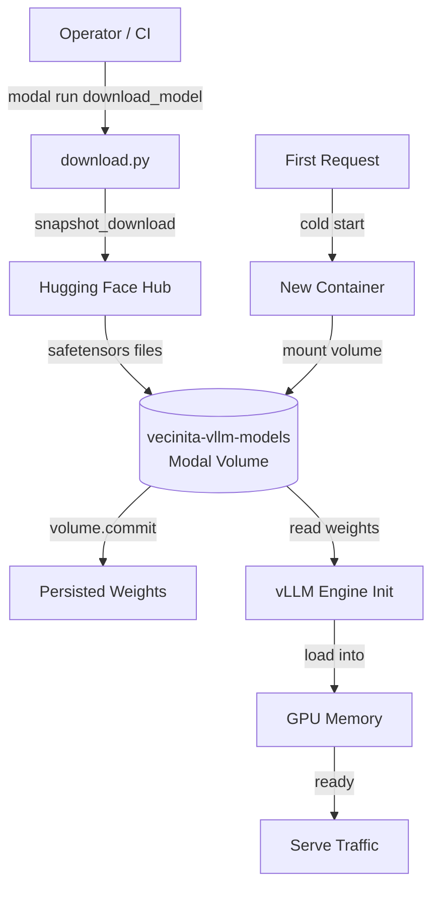
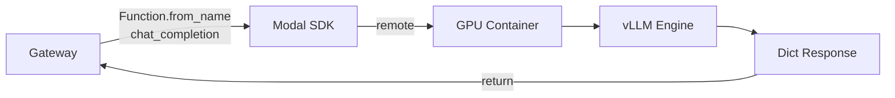

# vLLM Inference — Data Flow Diagram
> Auto-generated: 2026-05-12

## Primary Inference Flow

```mermaid
flowchart LR
    Agent[Agent Service] -->|POST /v1/chat/completions<br/>JSON| API[vLLM API Server]
    API -->|validate| VAL{Valid?}
    VAL -->|yes| TOK[Tokenize]
    VAL -->|no| ERR[422 Error]
    TOK --> SCHED[Scheduler<br/>Continuous Batch]
    SCHED --> GPU[GPU Inference<br/>PagedAttention]
    GPU --> DETOK[Detokenize]
    DETOK --> RESP[ChatCompletionResponse]
    RESP -->|JSON| Agent
```

## Streaming Flow

```mermaid
flowchart LR
    Agent[Agent Service] -->|POST stream:true| API[vLLM API Server]
    API --> TOK[Tokenize]
    TOK --> SCHED[Scheduler]
    SCHED --> GPU[GPU Inference]
    GPU -->|token batch| DELTA[SSE Delta Chunk]
    DELTA -->|data: ...| Agent
    GPU -->|more tokens| DELTA
    GPU -->|done| DONE[data: DONE]
    DONE --> Agent
```

## Model Weight Loading Flow

```mermaid
flowchart TD
    OP[Operator / CI] -->|modal run download_model| DL[download.py]
    DL -->|snapshot_download| HF[Hugging Face Hub]
    HF -->|safetensors files| VOL[(vecinita-vllm-models<br/>Modal Volume)]
    VOL -->|volume.commit| PERSIST[Persisted Weights]

    REQ[First Request] -->|cold start| CONTAINER[New Container]
    CONTAINER -->|mount volume| VOL
    VOL -->|read weights| VLLM[vLLM Engine Init]
    VLLM -->|load into| GPU[GPU Memory]
    GPU -->|ready| SERVE[Serve Traffic]
```

## Modal SDK Invocation Flow

```mermaid
flowchart LR
    GW[Gateway] -->|Function.from_name<br/>chat_completion| MODAL[Modal SDK]
    MODAL -->|remote| CONTAINER[GPU Container]
    CONTAINER --> VLLM[vLLM Engine]
    VLLM --> RESP[Dict Response]
    RESP -->|return| GW
```
