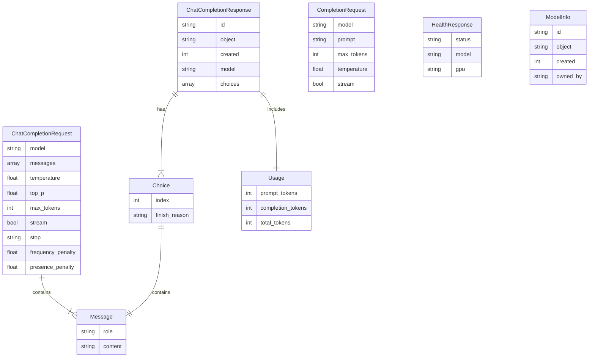
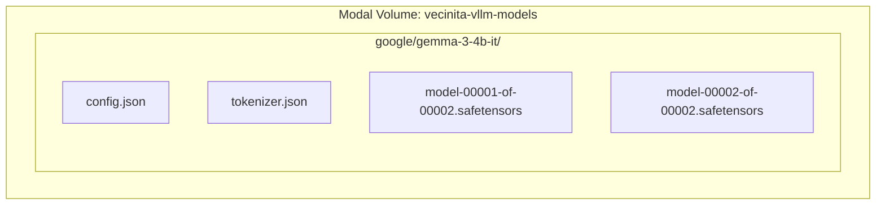

# vLLM Inference — Data Model Diagram
> Auto-generated: 2026-05-12

The vllm-inference service is stateless — it has no database tables. The diagram below shows the request/response schema relationships.

## Model Weight Storage (Volume)

