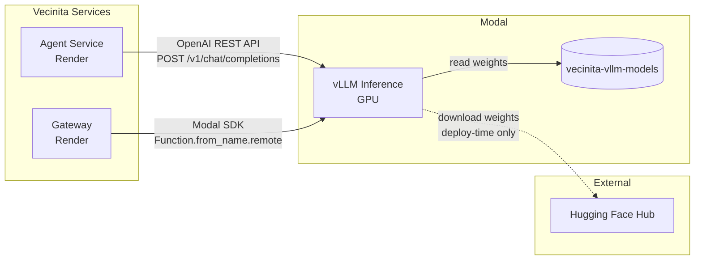
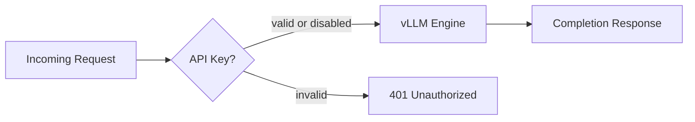

# vLLM Inference — Integration Points Diagram
> Auto-generated: 2026-05-12

## Service Connectivity



## Protocol Detail

```mermaid
graph TB
    subgraph Agent Path
        AG_LLAMA[LlamaIndex<br/>llama-index-llms-vllm] -->|HTTPS| VLLM_API[/v1/chat/completions]
    end

    subgraph Gateway Path
        GW_INV[Gateway Invoker<br/>modal.Function.from_name] -->|Modal RPC| VLLM_FN[chat_completion function]
    end

    subgraph vLLM Inference
        VLLM_API --> ENGINE[vLLM Engine]
        VLLM_FN --> ENGINE
    end
```

## Authentication Flow


