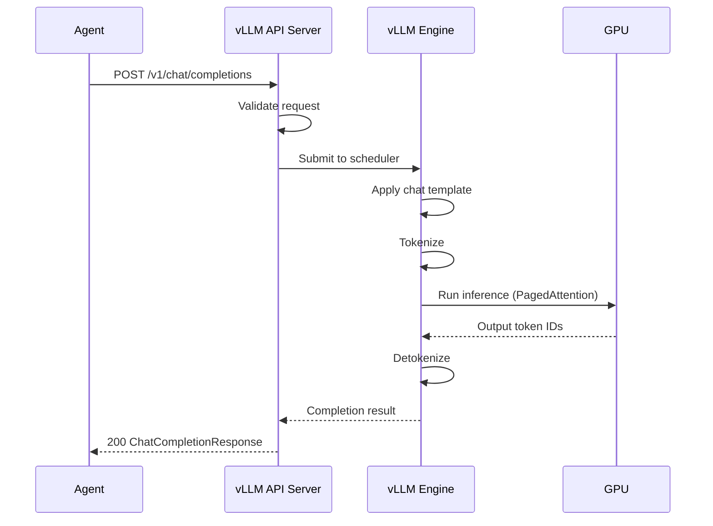
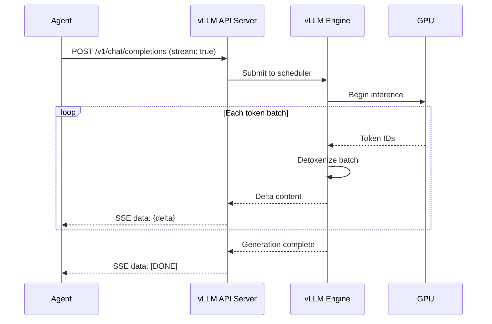
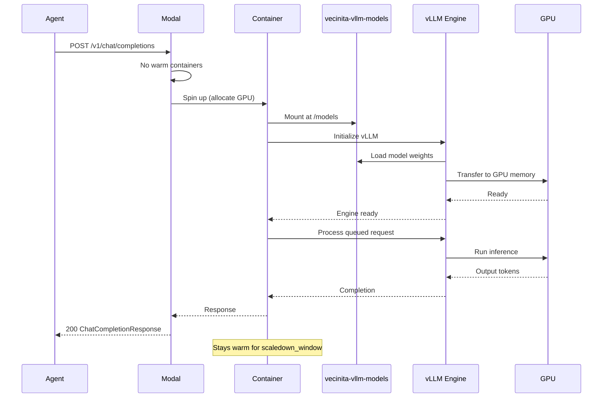
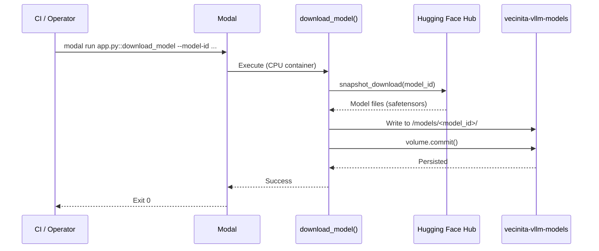
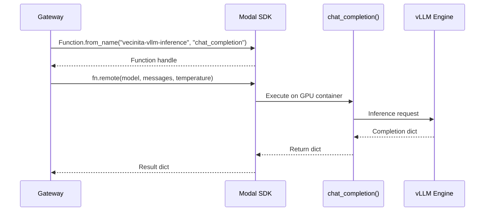
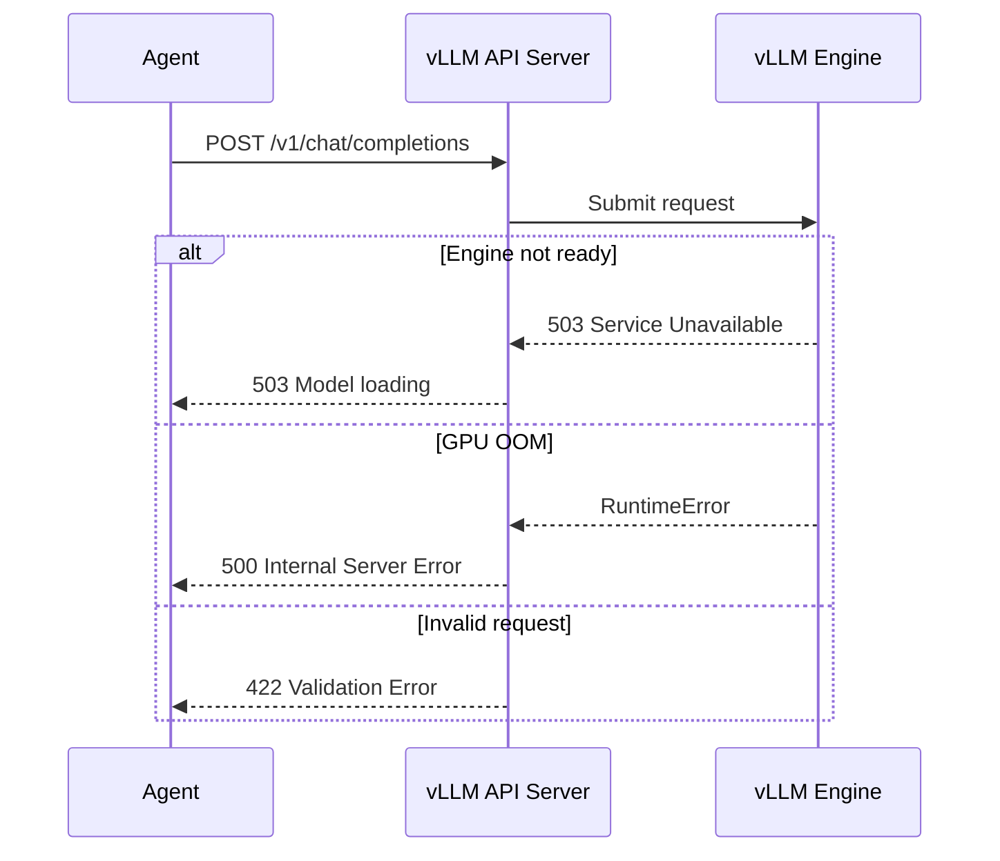

# vLLM Inference — Sequence Flow Diagrams
> Auto-generated: 2026-05-12

## Chat Completion (Non-Streaming)

## Chat Completion (Streaming)

## Cold Start Sequence

## Model Weight Download

## Gateway Modal SDK Invocation

## Error Flow

