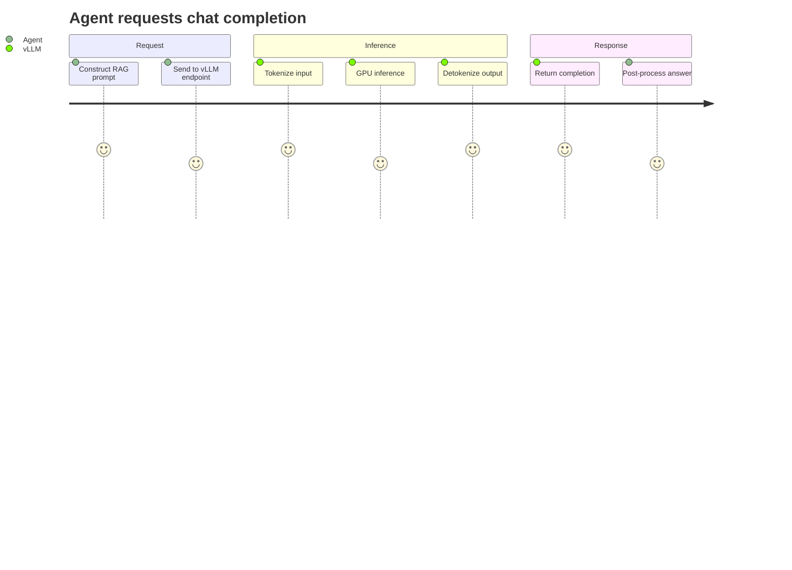
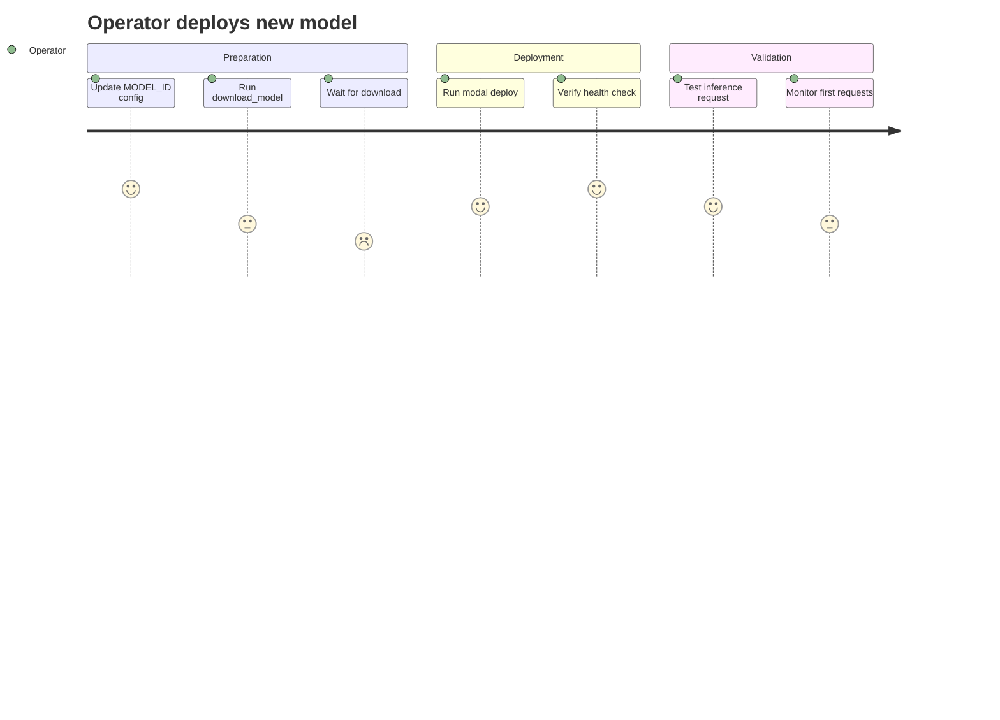
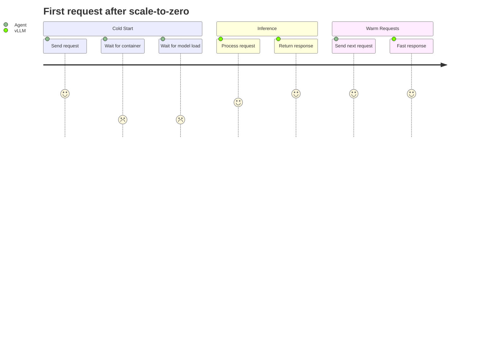

# vLLM Inference — User Journey Diagrams
> Auto-generated: 2026-05-12

## Chat Completion Request (Agent)

```mermaid
journey
    title Agent requests chat completion
    section Request
        Construct RAG prompt: 5: Agent
        Send to vLLM endpoint: 4: Agent
    section Inference
        Tokenize input: 5: vLLM
        GPU inference: 4: vLLM
        Detokenize output: 5: vLLM
    section Response
        Return completion: 5: vLLM
        Post-process answer: 4: Agent
```

## Model Deployment (Operator)

```mermaid
journey
    title Operator deploys new model
    section Preparation
        Update MODEL_ID config: 5: Operator
        Run download_model: 3: Operator
        Wait for download: 2: Operator
    section Deployment
        Run modal deploy: 4: Operator
        Verify health check: 5: Operator
    section Validation
        Test inference request: 4: Operator
        Monitor first requests: 3: Operator
```

## Cold Start Experience (Agent)

```mermaid
journey
    title First request after scale-to-zero
    section Cold Start
        Send request: 5: Agent
        Wait for container: 2: Agent
        Wait for model load: 2: Agent
    section Inference
        Process request: 4: vLLM
        Return response: 5: vLLM
    section Warm Requests
        Send next request: 5: Agent
        Fast response: 5: vLLM
```
