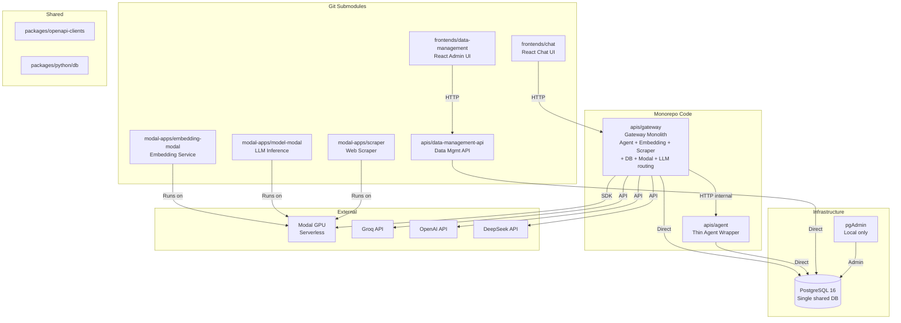

# Current Architecture

> Auto-generated: 2026-05-12

```mermaid
graph TB
    subgraph "Git Submodules"
        FE_CHAT[frontends/chat<br/>React Chat UI]
        FE_DM[frontends/data-management<br/>React Admin UI]
        API_DM[apis/data-management-api<br/>Data Mgmt API]
        SCRAPER[modal-apps/scraper<br/>Web Scraper]
        EMBED_MODAL[modal-apps/embedding-modal<br/>Embedding Service]
        MODEL_MODAL[modal-apps/model-modal<br/>LLM Inference]
    end

    subgraph "Monorepo Code"
        GATEWAY[apis/gateway<br/>Gateway Monolith<br/>Agent + Embedding + Scraper<br/>+ DB + Modal + LLM routing]
        AGENT[apis/agent<br/>Thin Agent Wrapper]
    end

    subgraph "Shared"
        OPENAPI[packages/openapi-clients]
        DB_PKG[packages/python/db]
    end

    subgraph "Infrastructure"
        PG[(PostgreSQL 16<br/>Single shared DB)]
        PGADMIN[pgAdmin<br/>Local only]
    end

    subgraph "External"
        MODAL_GPU[Modal GPU<br/>Serverless]
        GROQ[Groq API]
        OPENAI[OpenAI API]
        DEEPSEEK[DeepSeek API]
    end

    FE_CHAT -->|HTTP| GATEWAY
    FE_DM -->|HTTP| API_DM
    GATEWAY -->|HTTP internal| AGENT
    GATEWAY -->|SDK| MODAL_GPU
    GATEWAY -->|Direct| PG
    AGENT -->|Direct| PG
    API_DM -->|Direct| PG
    EMBED_MODAL -->|Runs on| MODAL_GPU
    MODEL_MODAL -->|Runs on| MODAL_GPU
    SCRAPER -->|Runs on| MODAL_GPU
    GATEWAY -->|API| GROQ
    GATEWAY -->|API| OPENAI
    GATEWAY -->|API| DEEPSEEK
    PGADMIN -->|Admin| PG
```
