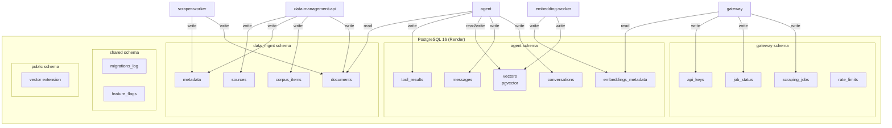

# Data Ownership Map

> Auto-generated: 2026-05-12

```mermaid
graph TB
    subgraph "PostgreSQL 16 (Render)"
        subgraph "gateway schema"
            G_JOBS[scraping_jobs]
            G_STATUS[job_status]
            G_KEYS[api_keys]
            G_RATE[rate_limits]
        end

        subgraph "agent schema"
            A_CONV[conversations]
            A_MSG[messages]
            A_VEC[vectors<br/>pgvector]
            A_TOOL[tool_results]
            A_EMETA[embeddings_metadata]
        end

        subgraph "data_mgmt schema"
            D_DOCS[documents]
            D_CORPUS[corpus_items]
            D_META[metadata]
            D_SRC[sources]
        end

        subgraph "shared schema"
            S_MIG[migrations_log]
            S_FLAGS[feature_flags]
        end

        subgraph "public schema"
            PG_VEC[vector extension]
        end
    end

    GW[gateway] -->|write| G_JOBS
    GW -->|write| G_STATUS
    GW -->|write| G_KEYS
    GW -->|read| A_EMETA

    AG[agent] -->|write| A_CONV
    AG -->|write| A_MSG
    AG -->|read/write| A_VEC
    AG -->|write| A_TOOL
    AG -->|read| D_DOCS

    DMA[data-management-api] -->|write| D_DOCS
    DMA -->|write| D_CORPUS
    DMA -->|write| D_META
    DMA -->|write| D_SRC

    EMB[embedding-worker] -->|write| A_VEC
    EMB -->|write| A_EMETA

    SCR[scraper-worker] -->|write| D_DOCS
    SCR -->|write| D_META
```
