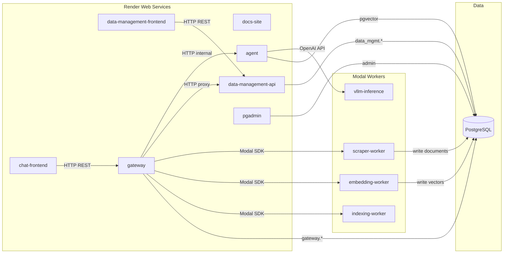
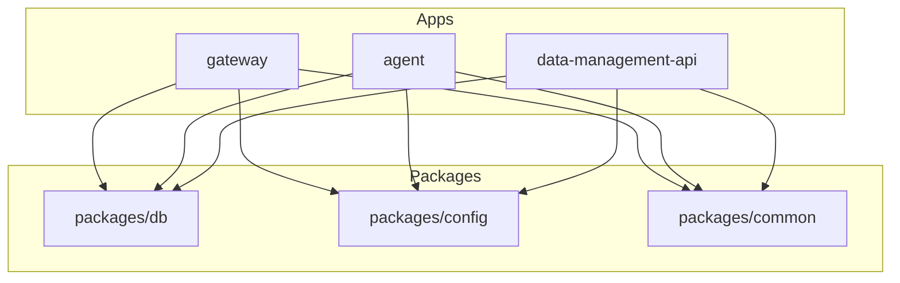
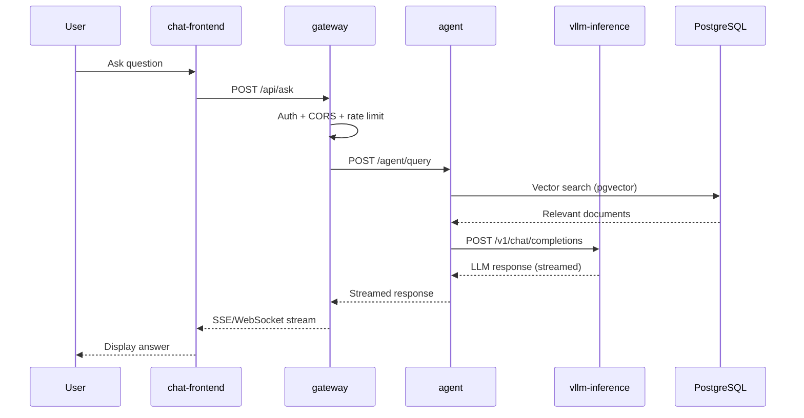
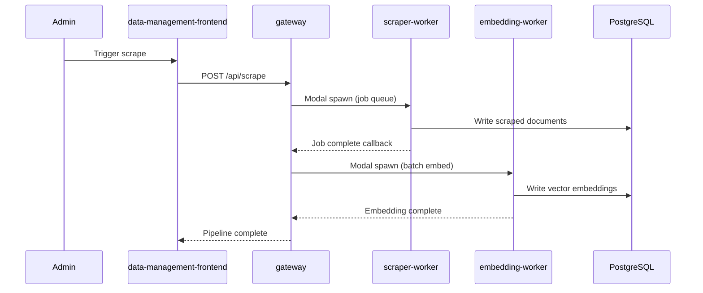

# Dependency Graph

> Auto-generated: 2026-05-12

## Service-to-Service Communication

```mermaid
graph LR
    subgraph "Render Web Services"
        CF[chat-frontend]
        DMF[data-management-frontend]
        DS[docs-site]
        GW[gateway]
        AG[agent]
        DMA[data-management-api]
        PGA[pgadmin]
    end

    subgraph "Modal Workers"
        VLLM[vllm-inference]
        EMB[embedding-worker]
        SCR[scraper-worker]
        IDX[indexing-worker]
    end

    subgraph "Data"
        PG[(PostgreSQL)]
    end

    CF -->|HTTP REST| GW
    DMF -->|HTTP REST| DMA
    GW -->|HTTP internal| AG
    GW -->|HTTP proxy| DMA
    GW -->|Modal SDK| SCR
    GW -->|Modal SDK| EMB
    GW -->|Modal SDK| IDX
    AG -->|OpenAI API| VLLM
    AG -->|pgvector| PG
    GW -->|gateway.*| PG
    DMA -->|data_mgmt.*| PG
    PGA -->|admin| PG
    EMB -->|write vectors| PG
    SCR -->|write documents| PG
```

## Package Dependencies

```mermaid
graph TB
    subgraph "Apps"
        GW[gateway]
        AG[agent]
        DMA[data-management-api]
    end

    subgraph "Packages"
        DB[packages/db]
        CFG[packages/config]
        CMN[packages/common]
    end

    GW --> DB
    GW --> CFG
    GW --> CMN
    AG --> DB
    AG --> CFG
    AG --> CMN
    DMA --> DB
    DMA --> CFG
    DMA --> CMN
```

## Data Flow: Chat Query

```mermaid
sequenceDiagram
    participant User
    participant ChatUI as chat-frontend
    participant GW as gateway
    participant Agent as agent
    participant VLLM as vllm-inference
    participant PG as PostgreSQL

    User->>ChatUI: Ask question
    ChatUI->>GW: POST /api/ask
    GW->>GW: Auth + CORS + rate limit
    GW->>Agent: POST /agent/query
    Agent->>PG: Vector search (pgvector)
    PG-->>Agent: Relevant documents
    Agent->>VLLM: POST /v1/chat/completions
    VLLM-->>Agent: LLM response (streamed)
    Agent-->>GW: Streamed response
    GW-->>ChatUI: SSE/WebSocket stream
    ChatUI-->>User: Display answer
```

## Data Flow: Scraping Pipeline

```mermaid
sequenceDiagram
    participant Admin
    participant DMFE as data-management-frontend
    participant GW as gateway
    participant Scraper as scraper-worker
    participant Embed as embedding-worker
    participant PG as PostgreSQL

    Admin->>DMFE: Trigger scrape
    DMFE->>GW: POST /api/scrape
    GW->>Scraper: Modal spawn (job queue)
    Scraper->>PG: Write scraped documents
    Scraper-->>GW: Job complete callback
    GW->>Embed: Modal spawn (batch embed)
    Embed->>PG: Write vector embeddings
    Embed-->>GW: Embedding complete
    GW-->>DMFE: Pipeline complete
```
