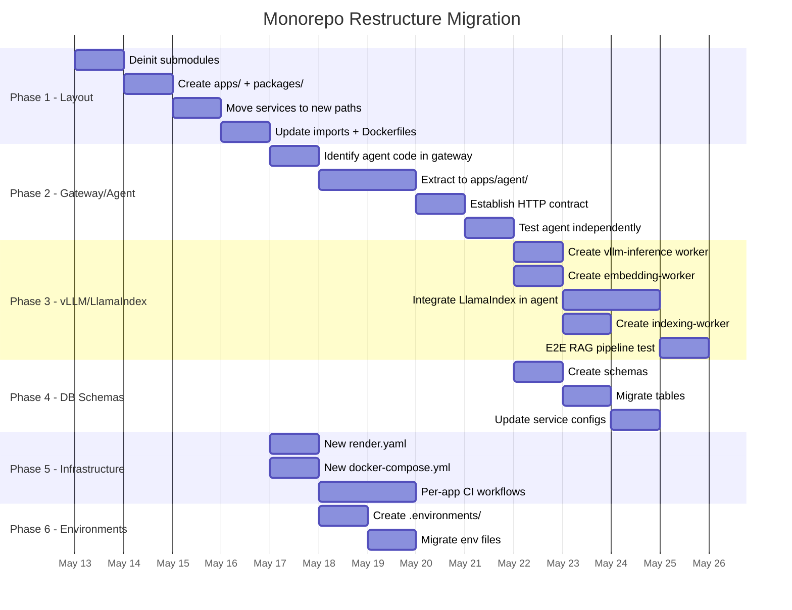
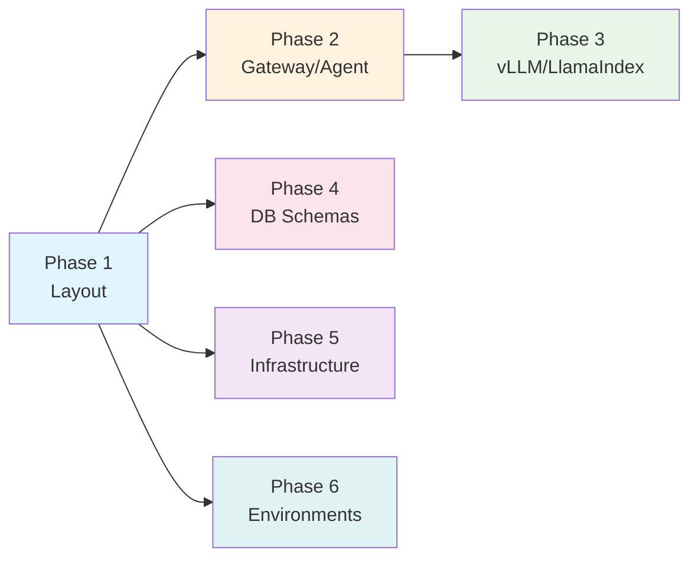

# Migration Sequence

> Auto-generated: 2026-05-12

```mermaid
gantt
    title Monorepo Restructure Migration
    dateFormat YYYY-MM-DD
    axisFormat %b %d

    section Phase 1 - Layout
    Deinit submodules           :p1a, 2026-05-13, 1d
    Create apps/ + packages/    :p1b, after p1a, 1d
    Move services to new paths  :p1c, after p1b, 1d
    Update imports + Dockerfiles:p1d, after p1c, 1d

    section Phase 2 - Gateway/Agent
    Identify agent code in gateway :p2a, after p1d, 1d
    Extract to apps/agent/         :p2b, after p2a, 2d
    Establish HTTP contract        :p2c, after p2b, 1d
    Test agent independently       :p2d, after p2c, 1d

    section Phase 3 - vLLM/LlamaIndex
    Create vllm-inference worker   :p3a, after p2d, 1d
    Create embedding-worker        :p3b, after p2d, 1d
    Integrate LlamaIndex in agent  :p3c, after p3a, 2d
    Create indexing-worker          :p3d, after p3b, 1d
    E2E RAG pipeline test          :p3e, after p3c, 1d

    section Phase 4 - DB Schemas
    Create schemas                 :p4a, after p2d, 1d
    Migrate tables                 :p4b, after p4a, 1d
    Update service configs         :p4c, after p4b, 1d

    section Phase 5 - Infrastructure
    New render.yaml                :p5a, after p1d, 1d
    New docker-compose.yml         :p5b, after p1d, 1d
    Per-app CI workflows           :p5c, after p5a, 2d

    section Phase 6 - Environments
    Create .environments/          :p6a, after p5b, 1d
    Migrate env files              :p6b, after p6a, 1d
```

```mermaid
graph LR
    P1[Phase 1<br/>Layout] --> P2[Phase 2<br/>Gateway/Agent]
    P2 --> P3[Phase 3<br/>vLLM/LlamaIndex]
    P1 --> P4[Phase 4<br/>DB Schemas]
    P1 --> P5[Phase 5<br/>Infrastructure]
    P1 --> P6[Phase 6<br/>Environments]

    style P1 fill:#e1f5fe
    style P2 fill:#fff3e0
    style P3 fill:#e8f5e9
    style P4 fill:#fce4ec
    style P5 fill:#f3e5f5
    style P6 fill:#e0f2f1
```
