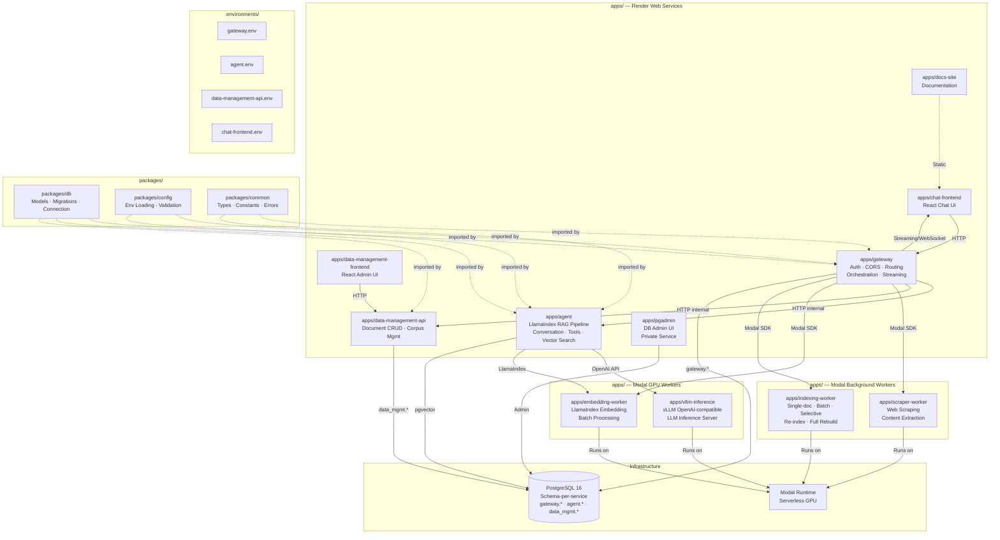

# Proposed Architecture

> Auto-generated: 2026-05-12

```mermaid
graph TB
    subgraph "apps/ — Render Web Services"
        FE_CHAT[apps/chat-frontend<br/>React Chat UI]
        FE_DM[apps/data-management-frontend<br/>React Admin UI]
        DOCS[apps/docs-site<br/>Documentation]
        GW[apps/gateway<br/>Auth · CORS · Routing<br/>Orchestration · Streaming]
        AG[apps/agent<br/>LlamaIndex RAG Pipeline<br/>Conversation · Tools · Vector Search]
        DM_API[apps/data-management-api<br/>Document CRUD · Corpus Mgmt]
        PGA[apps/pgadmin<br/>DB Admin UI<br/>Private Service]
    end

    subgraph "apps/ — Modal GPU Workers"
        VLLM[apps/vllm-inference<br/>vLLM OpenAI-compatible<br/>LLM Inference Server]
        EMBED[apps/embedding-worker<br/>LlamaIndex Embedding<br/>Batch Processing]
    end

    subgraph "apps/ — Modal Background Workers"
        SCRAPE[apps/scraper-worker<br/>Web Scraping<br/>Content Extraction]
        INDEX[apps/indexing-worker<br/>Single-doc · Batch · Selective<br/>Re-index · Full Rebuild]
    end

    subgraph "packages/"
        PKG_DB[packages/db<br/>Models · Migrations · Connection]
        PKG_CFG[packages/config<br/>Env Loading · Validation]
        PKG_COMMON[packages/common<br/>Types · Constants · Errors]
    end

    subgraph "Infrastructure"
        PG[(PostgreSQL 16<br/>Schema-per-service<br/>gateway.* · agent.* · data_mgmt.*)]
        MODAL_RT[Modal Runtime<br/>Serverless GPU]
    end

    subgraph ".environments/"
        ENV_GW[gateway.env]
        ENV_AG[agent.env]
        ENV_DM[data-management-api.env]
        ENV_FE[chat-frontend.env]
    end

    FE_CHAT -->|HTTP| GW
    FE_DM -->|HTTP| DM_API
    DOCS -.->|Static| FE_CHAT

    GW -->|HTTP internal| AG
    GW -->|HTTP internal| DM_API
    GW -->|Modal SDK| SCRAPE
    GW -->|Modal SDK| EMBED
    GW -->|Modal SDK| INDEX
    GW -->|Streaming/WebSocket| FE_CHAT

    AG -->|OpenAI API| VLLM
    AG -->|LlamaIndex| EMBED
    AG -->|pgvector| PG

    GW -->|gateway.*| PG
    DM_API -->|data_mgmt.*| PG
    PGA -->|Admin| PG

    VLLM -->|Runs on| MODAL_RT
    EMBED -->|Runs on| MODAL_RT
    SCRAPE -->|Runs on| MODAL_RT
    INDEX -->|Runs on| MODAL_RT

    PKG_DB -.->|imported by| GW
    PKG_DB -.->|imported by| AG
    PKG_DB -.->|imported by| DM_API
    PKG_CFG -.->|imported by| GW
    PKG_CFG -.->|imported by| AG
    PKG_COMMON -.->|imported by| GW
    PKG_COMMON -.->|imported by| AG
```
